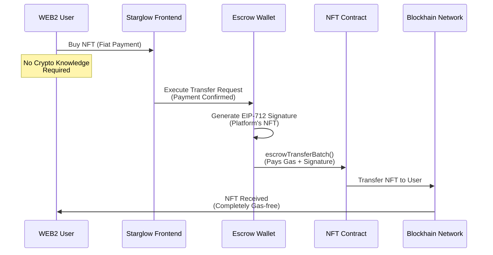
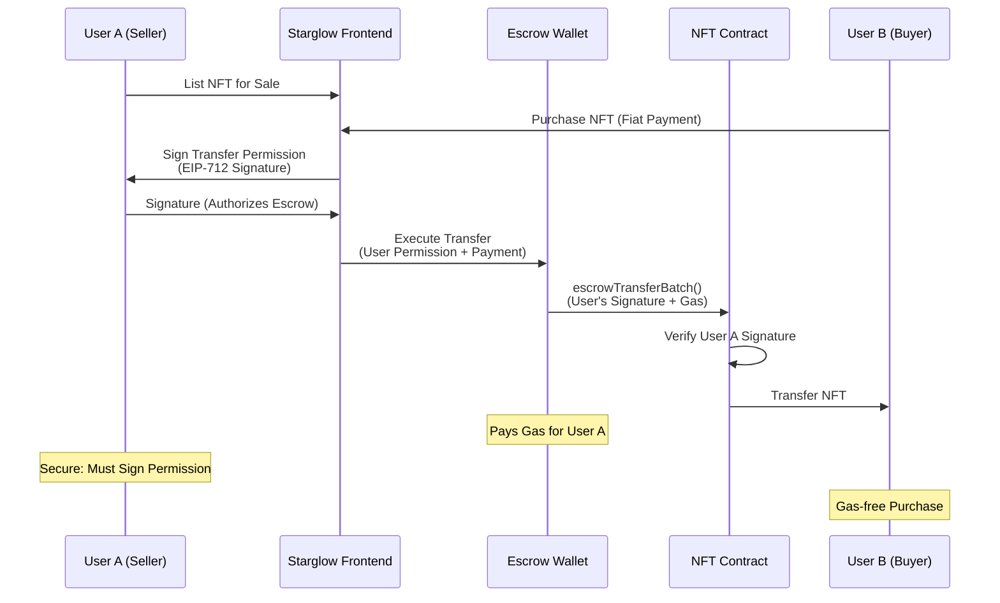
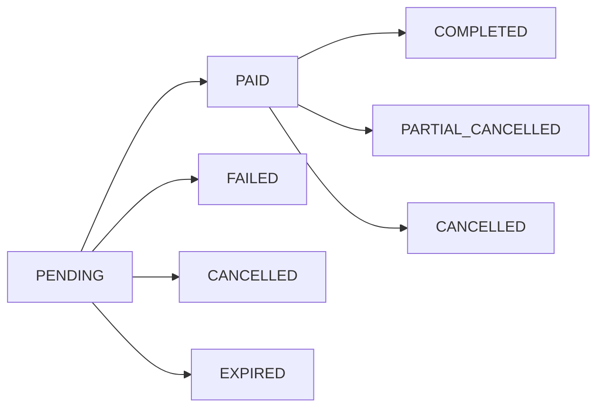

# Starglow Technology Architecture Documentation

---

# Web3 Platform Architecture

> **Frontend-focused NFT platform with blockchain integration**

## Core Stack

### Frontend Framework

- **Next.js 15.3.4** - App Router architecture with React Server Components
- **React 19.1.0** - Client-side UI framework
- **TypeScript 5.8.3** - Static type checking across entire codebase

### Authentication

- **NextAuth.js 5.0.0** - Authentication framework with Prisma adapter integration

### State Management

- **TanStack Query 5.71.5** - Server state synchronization and caching

### Database & ORM

- **Prisma ORM 6.10.1** - Type-safe database client and schema management
- **Prisma Accelerate 2.0.1** - Global database cache and connection pooling
- **Prisma PostgreSQL** - Primary relational database from Prisma

### Storage

- **Vercel Blob 0.27.3** - File storage for media assets
- **Web3.Storage 4.5.5** - IPFS-based decentralized storage for NFT metadata

### Payment System

- **PortOne Browser SDK 0.0.17** - Client-side payment integration
- **PortOne Server SDK 0.14.0** - Server-side payment processing and webhooks

### Web3 Infrastructure

- **Solidity + Hardhat 2.14.0** - Smart contract development and deployment framework
- **OpenZeppelin Contracts 5.2.0** - Secure smart contract library
- **Wagmi 2.15.6** - React hooks for Ethereum interactions
- **Viem 2.30.5** - TypeScript interface for Ethereum
- **RainbowKit 2.2.4** - Wallet connection interface

### UI & Animation

- **Tailwind CSS 4.0.17** - Utility-first CSS framework
- **Radix UI** - Unstyled accessible component primitives
- **Shadcn/ui + Magic UI** - Custom component library with animated UI components
- **Framer Motion 12.6.2** - Animation and gesture library

### 3D Graphics & Visualization

- **Three.js 0.176.0** - 3D graphics library
- **Recharts 2.15.3** - Data visualization and charting library

### Development & Testing

- **Jest 30.0.2** - JavaScript testing framework
- **ESLint 9** - Code linting and formatting
- **Hardhat Gas Reporter 1.0.8** - Smart contract gas optimization

### Deployment

- **Vercel** - Serverless deployment platform
- **Edge Functions** - API routes with edge computing

## Architecture Patterns

### Layered Architecture

```bash
app/
├── actions/          # Server Actions (database operations)
├── queries/          # TanStack Query (caching layer)
├── mutations/        # Data mutations with cache invalidation
├── hooks/            # Business logic composition
└── components/       # UI components
```

### Key Design Principles

- **Server Actions**: Next.js 15 native server functions with type safety
- **Query Management**: Centralized caching with query key system
- **Type Safety**: Full TypeScript coverage across database-to-UI
- **Separation of Concerns**: Clear data flow from server to client
- **Performance**: Strategic cache times based on data volatility

## Web3 Integration

### Blockchain Infrastructure

- **Multi-chain Support**: Flexible architecture for network migration
- **Smart Contract Stack**: Solidity + Hardhat with TypeScript type generation

### Private Key Security Architecture

> **Implementation**: Permanently deletes all key fragments from both storage locations upon backup confirmation.

- **Split-Key Storage**: Private keys split into two encrypted fragments stored separately - Database (Part 1) + Vercel Blob (Part 2). Immediate deletion after user backup confirmation.

- **Security Features**
  - **Hidden Algorithm**: Encryption method stored in environment variables
  - **Unique Nonce**: Each fragment encrypted with cryptographically secure random nonce
  - **Hash Verification**: SHA-256 integrity checks prevent tampering
  - **Session-Based Access**: Requires active user session for decryption

### Token Bound Accounts (TBA)

- **ERC6551 Standard**: Each NFT automatically owns a dedicated smart wallet
- **Multi-signature Support**: Platform and users can execute transactions with proper authorization
- **Dynamic Ownership**: Wallet control follows NFT ownership transfers
- **Advanced Permissions**: Permitted signers system for flexible access control

### Smart Contract Architecture

```bash
web3/contracts/
├── StarglowTBA.sol          # ERC6551 Token Bound Account implementation
├── SPGNFTCollection.sol     # NFT collection with TBA integration
└── typechain-types/         # TypeScript contract bindings
```

### Escrow Wallet System (Enhance WEB2 UX)

> **Problem**: WEB2 users avoid blockchain services due to gas fee complexity and crypto wallet requirements.<br />**Solution**: Starglow's dual-mode Escrow Wallet system handles both purchases and P2P trading.

#### Scenario 1: NFT Purchase (Platform → User) **[Production Ready]**



#### Scenario 2: User-to-User Trading (Secure P2P) **[In Development]**



#### Technical Implementation

| Component                 | Implementation                                                    | Status         |
| ------------------------- | ----------------------------------------------------------------- | -------------- |
| **Purchase Flow**         | Escrow wallet auto-signs for platform-owned NFTs                  | ✅ Live        |
| **P2P Trading**           | User signs EIP-712 permission, Escrow executes & pays gas         | 🚧 Development |
| **Security Verification** | `require(signer == owner, "Invalid signature")` in smart contract | ✅ Complete    |
| **Batch Processing**      | `escrowTransferBatch()` for efficient multi-transfer operations   | ✅ Complete    |
| **Gas Sponsorship**       | Platform absorbs all transaction costs for both scenarios         | ✅ Complete    |
| **Nonce Management**      | Prevents replay attacks with incremental user nonces              | ✅ Complete    |

#### Business Impact

- **Purchase Flow** [Live]: Pure WEB2 experience - zero crypto knowledge required
- **P2P Trading** [Development]: Secure user authorization + gas-free execution
- **Market Innovation**: First platform to eliminate gas fees while maintaining security
- **Mainstream Adoption**: Removes all WEB3 friction for both buying and trading

## Telegram Mini App Optimization

### Performance & Optimization

- **Performance Monitoring**: 1000ms response threshold with Web Vitals collection
- **React Optimization**: 20+ memoized components with strategic caching patterns

### Authentication & Integration

- **Seamless Authentication**: HMAC-verified initDataUnsafe extraction with referral support
- **Native Integration**: Dedicated domains with platform-specific share functionality

## Payment System (PortOne Integration)

### Payment Infrastructure

- **Client-Side Integration**: PortOne Browser SDK 0.0.17 for secure payment UI
- **Server-Side Processing**: PortOne Server SDK 0.14.0 for payment verification and webhooks
- **Multi-Channel Support**: Separate channel configurations for different payment methods

### Supported Payment Methods

| Region            | Method              | Description                                                |
| ----------------- | ------------------- | ---------------------------------------------------------- |
| **Korea**         | Card Payments       | Direct card processing with domestic providers             |
| **Korea**         | TossPay             | Real-time bank transfer and card integration               |
| **Korea**         | KakaoPay            | Mobile-first payment with Kakao ecosystem                  |
| **International** | PayPal              | Global payment processing with SPB (Smart Payment Buttons) |
| **International** | International Cards | Cross-border card payment support                          |

### Backend Processing

- **Payment Verification**: Real-time verification against PortOne API with retry logic
- **Webhook Integration**: Secure webhook handling with signature verification
- **Status Management**: Comprehensive payment status tracking (PENDING → PAID → COMPLETED)

### Multi-Currency Support

- **Real-time Exchange Rates**: External API integration for accurate currency conversion
- **Database Caching**: Exchange rate persistence with timestamp tracking
- **Price Calculation**: Dynamic pricing based on product currency and user preference

### Security Features

- **Duplicate Prevention**: 10-second cooldown window for identical payment attempts
- **Amount Verification**: Cross-validation between database and PortOne API responses
- **Webhook Security**: HMAC signature verification for all incoming webhooks
- **Error Handling**: Comprehensive error codes with detailed logging

### Payment States Management



## Scalability Architecture

### Performance Optimization

- **Centralized Query Management**: QueryKey system with cache strategy hierarchy
- **Global Database Cache**: Prisma Accelerate extension with connection pooling optimization
- **Client-Side Caching**: Singleton/Multiton pattern for client instances with network-address composite keys

### Smart Contract Features

- **Multi-signature Support**: Advanced permission system for TBA accounts
- **Gas Optimization**: Hardhat Gas Reporter for cost-efficient deployments
- **Type Safety**: Full TypeScript coverage for smart contract interactions

---

# Music Industry Valuation System

> **AI-powered music artist valuation with multi-source data collection**

## Core Stack

### Backend Framework

- **Python 3.11** - Main programming language
- **AsyncIO** - Asynchronous data collection
- **Dotenv** - Environment configuration

### Data Collection & Web Scraping

- **Beautiful Soup 4** - Web scraping and HTML parsing
- **Selenium** - Browser automation
- **Playwright** - Web scraping automation
- **Requests-HTML** - HTTP requests with JavaScript support
- **HTTPX** - HTTP client
- **Tenacity** - Retry logic

### Machine Learning Stack

- **Scikit-learn** - ML models (RandomForest, GradientBoosting)
- **XGBoost** - Gradient boosting
- **LightGBM** - Gradient boosting
- **PyTorch** - Neural networks
- **TensorFlow/Keras** - Deep learning models
- **Joblib** - Model serialization

### Natural Language Processing

- **KoNLPy** - Korean text analysis
- **NLTK** - English text processing
- **Transformers** - Pre-trained models
- **OpenAI API** - GPT-3.5 for market analysis

### Database & Storage

- **Google Cloud Firestore** - Primary database
- **Firebase Admin** - Database management
- **Google Sheets API** - Data pipeline integration

### Data Processing

- **Pandas** - Data manipulation
- **NumPy** - Numerical computing
- **RapidFuzz** - String matching
- **Openpyxl** - Excel file processing

## Data Sources

### Music Platforms

| Platform         | Data Type                   | Implementation   |
| ---------------- | --------------------------- | ---------------- |
| **Circle Chart** | Weekly charts, album sales  | Web scraping     |
| **Melon**        | Albums, artists, songs data | Web scraping     |
| **Spotify**      | Track features, popularity  | Spotify Web API  |
| **YouTube**      | Video data, comments        | YouTube Data API |

### Social Media

| Platform      | Data Type         | Implementation |
| ------------- | ----------------- | -------------- |
| **Instagram** | Posts, engagement | Instaloader    |
| **Twitter**   | Tweets, metrics   | Twitter API    |

### Market Data

| Source            | Data Type          | Implementation    |
| ----------------- | ------------------ | ----------------- |
| **Google Sheets** | Market growth data | Google Sheets API |
| **Naver**         | Concert/broadcast  | Web scraping      |
| **SerpAPI**       | Google Trends      | API               |

## Project Structure

### Modular Architecture

```bash
valuation/
├── main.py                            # Main orchestration script
├── requirements.txt                   # Dependencies
├── best_model.pkl                     # Trained ML model
├── performance_with_predictions.csv   # Model output
├── Macro/                             # Market analysis
│   └── market_growth.py
├── Meso/                              # Chart and platform data
│   ├── circle_chart_collector.py
│   ├── melon_album_data_collector.py
│   └── spotify_songs_data_collector.py
├── Micro/                             # Individual metrics
│   ├── performance_data_collector.py
│   ├── broadcast_data_collector.py
│   ├── youtube_data_collector.py
│   ├── circlechart_album_sales.py
│   └── albums_comments_analysis.py
├── Valuation/                         # Core valuation logic
│   └── Valuation_main.py
├── Prediction/                        # ML prediction models
│   ├── performance.py
│   └── performance.sav
├── Firebase/                          # Database operations
│   └── firestore_handler.py
├── GoogleSheets/                      # Sheet operations
│   └── sheets.py
└── utils/                             # Logging utilities
    └── logger.py
```

### Data Flow

- **Data Collection**: Async collection from multiple sources
- **Storage**: Firebase Firestore + Google Sheets pipeline
- **Processing**: Feature engineering and data validation
- **Modeling**: Multi-algorithm ML pipeline
- **Output**: Valuation metrics and predictions

## Implementation Details

### Data Collection Functions

| Module      | Function                                            | Purpose                      |
| ----------- | --------------------------------------------------- | ---------------------------- |
| **main.py** | `get_circle_charts_and_save_to_firestore()`         | Circle Chart data collection |
| **main.py** | `get_target_album_data_and_save_to_firestore()`     | Album and track data         |
| **main.py** | `get_youtube_data_and_save_to_firestore()`          | YouTube videos and comments  |
| **main.py** | `get_album_sales_and_update_firestore_album_data()` | Sales data integration       |

### Machine Learning Pipeline

| Component               | Implementation                          | Models Used                                |
| ----------------------- | --------------------------------------- | ------------------------------------------ |
| **Feature Engineering** | TF-IDF vectorization, numerical scaling | StandardScaler, TfidfVectorizer            |
| **Model Training**      | Multi-algorithm comparison              | RandomForest, XGBoost, TensorFlow, PyTorch |
| **Evaluation**          | Cross-validation, performance metrics   | MAE, R² score                              |
| **Prediction**          | Revenue forecasting                     | Best performing model (saved as .pkl)      |

## Valuation Components

### Analysis Hierarchy

| Level     | Module                 | Function                                           |
| --------- | ---------------------- | -------------------------------------------------- |
| **Macro** | market_growth.py       | Market trend analysis with OpenAI interpretation   |
| **Meso**  | Album/Chart collectors | Platform-level data (Melon, Circle Chart, Spotify) |
| **Micro** | Individual collectors  | Performance, broadcast, YouTube, sales data        |

### ML Model Implementation

| Model Type            | Library       | Implementation                          |
| --------------------- | ------------- | --------------------------------------- |
| **Ensemble**          | Scikit-learn  | RandomForest, GradientBoosting          |
| **Gradient Boosting** | XGBoost       | Performance prediction                  |
| **Deep Learning**     | TensorFlow    | Neural network with numeric+text inputs |
| **Deep Learning**     | PyTorch       | Custom neural network architecture      |
| **NLP**               | KoNLPy + NLTK | Korean/English text processing          |

### Key Functions

- **Revenue Prediction**: ML models trained on performance data
- **Feature Engineering**: TF-IDF + numerical features
- **Model Evaluation**: Cross-validation, MAE, R² metrics
- **Data Integration**: Fuzzy matching between platforms

## Technical Features

### Async Processing

- **AsyncIO**: Concurrent data collection from multiple sources
- **Tenacity**: Retry logic with exponential backoff
- **Error Handling**: Comprehensive logging and exception management

### Data Storage

| Component      | Technology                   | Purpose                               |
| -------------- | ---------------------------- | ------------------------------------- |
| **Primary DB** | Firestore                    | Artist, album, song, performance data |
| **Pipeline**   | Google Sheets                | Market data integration               |
| **Cache**      | aiocache (SimpleMemoryCache) | TTL-based response caching            |

### Environment Configuration

- **Dotenv**: Environment variable management
- **Service Account**: Google APIs authentication
- **API Keys**: External service integration (OpenAI, Spotify, YouTube)

### Data Processing

- **Fuzzy Matching**: RapidFuzz for cross-platform data alignment
- **Date Parsing**: Multiple format support with dateutil
- **Text Processing**: Korean (KoNLPy) + English (NLTK) tokenization
- **Feature Engineering**: StandardScaler, TF-IDF vectorization

### Model Output

- **Serialization**: Joblib for model persistence
- **Predictions**: CSV export with performance metrics
- **Evaluation**: MAE, R² score validation

---

## 🔄 System Integration

Both systems work together to provide comprehensive music industry insights:

- **Web3 Platform**: Handles NFT creation, trading, and user interactions
- **Valuation System**: Provides AI-powered artist/album valuation data
- **Data Flow**: Valuation insights inform NFT pricing and market strategies
- **Technology Bridge**: Shared data visualization (Recharts) and analytics components
