# Codebase Research Report

## Query
Show me the entire codbase maps

## Answer
### System Diagram

```mermaid
graph LR
    subgraph app_subgraph["App Directory"]
        actions_node["Actions<br>artists,assets,blockchain,NFTs"]
        api_node["API Routes<br>authentication,cron jobs,webhooks"]
        auth_node["Authentication<br>components,utilities"]
        mutations_node["Mutations"]
        queries_node["Queries"]
        types_node["Types"]
    end
    subgraph components_subgraph["Components Directory"]
        adminComponents_node["Admin Components"]
        artistComponents_node["Artist Components"]
        atoms_node["Atoms<br>Basic UI elements"]
        eventsComponents_node["Event Components"]
        navigationComponents_node["Navigation Components"]
        nftComponents_node["NFT Components<br>NFTs,collections"]
        uiComponents_node["UI Components<br>Radix UI,Tailwind CSS"]
        userComponents_node["User Components<br>user profiles,rewards"]
    end
    subgraph lib_subgraph["Lib Directory"]
        cache_node["Cache Client"]
        pinata_node["Pinata Client"]
        prismaClient_node["Prisma Client"]
        supabaseClient_node["Supabase Client"]
        utils_node["Utils<br>encryption,formatting,responsive classes"]
        libTypes_node["Types"]
    end
    subgraph web3_subgraph["Web3 Directory"]
        artifacts_node["Artifacts<br>compiled smart contract artifacts"]
        contracts_node["Contracts<br>Solidity smart contract source code"]
        scripts_node["Scripts<br>deploying,interacting with smart contracts"]
        typechainTypes_node["Typechain Types<br>TypeScript type definitions"]
    end
    public_node["Public Directory<br>images,fonts"]
    scriptsDir_node["Scripts Directory"]
    wiki_node["Wiki Directory<br>project documentation"]
    prismaDir_node["Prisma Directory<br>database schema,migrations"]
    app_subgraph --> components_subgraph
    app_subgraph --> lib_subgraph
    app_subgraph --> web3_subgraph
    lib_subgraph --> prismaDir_node
```

### Summary
# CodeViz [Entire Codebase Maps]

## Directory Structure

The codebase is structured as follows:

-   **starglow**
    -   **app**: Contains the main application logic, including actions, API routes, pages, and supporting files.
        -   **actions**: TypeScript files defining actions related to various features like artists, assets, blockchain, NFTs, payment, user, etc. (file:starglow/app/actions)
        -   **admin**: Contains pages and components for admin functionalities, such as managing artists, assets, events, polls, quests, staking, story, and users. (file:starglow/app/admin)
        -   **api**: Defines API routes for authentication, cron jobs, PortOne webhooks, and Telegram integration. (file:starglow/app/api)
        -   **artists**: Contains pages for displaying artist details. (file:starglow/app/artists)
        -   **auth**: Includes authentication-related components and utilities. (file:starglow/app/auth)
        -   **backups**: Contains backup files. (file:starglow/app/backups)
        -   **blockchain**: Defines blockchain-related configurations, including ABIs for smart contracts. (file:starglow/app/blockchain)
        -   **collections**: Contains pages for displaying collection details. (file:starglow/app/collections)
        -   **error**: Defines a custom error page. (file:starglow/app/error)
        -   **events**: Contains pages for displaying events. (file:starglow/app/events)
        -   **hooks**: Defines custom React hooks for accessing and managing data. (file:starglow/app/hooks)
        -   **invite**: Contains invite page. (file:starglow/app/invite)
        -   **mutations**: TypeScript files defining mutations for various features. (file:starglow/app/mutations)
        -   **nfts**: Contains pages for displaying NFTs. (file:starglow/app/nfts)
        -   **payment**: Contains pages related to payment processing. (file:starglow/app/payment)
        -   **polls**: Contains pages for displaying polls. (file:starglow/app/polls)
        -   **queries**: TypeScript files defining queries for fetching data. (file:starglow/app/queries)
        -   **quests**: Contains pages for displaying quests. (file:starglow/app/quests)
        -   **story**: Contains files related to the story feature, including escrow wallet, interaction, metadata, network, NFT, SPG, TBA, transfer, and user wallet functionalities. (file:starglow/app/story)
        -   **types**: Defines TypeScript types used throughout the application. (file:starglow/app/types)
        -   **user**: Contains pages related to user profiles and settings. (file:starglow/app/user)
        -   `favicon.ico`, `globals.css`, `layout.tsx`, `page.tsx`, `Providers.tsx`, `queryKeys.ts`: Core application files.
    -   **components**: Contains reusable React components.
        -   **admin**: Contains admin-specific components for managing artists, assets, data migrations, events, on-chain data, polls, quests, staking, story, and users. (file:starglow/components/admin)
        -   **artists**: Contains components related to artists, such as artist feeds and messages. (file:starglow/components/artists)
        -   **atoms**: Contains basic UI elements and components. (file:starglow/components/atoms)
        -   **events**: Contains components for displaying event information. (file:starglow/components/events)
        -   **magicui**: Contains UI components with special effects. (file:starglow/components/magicui)
        -   **main**: Contains components for the main sections of the application, such as the footer and partner listings. (file:starglow/components/main)
        -   **navigation**: Contains components for navigation bars. (file:starglow/components/navigation)
        -   **nfts**: Contains components for displaying NFTs and collections. (file:starglow/components/nfts)
        -   **payment**: Contains components related to payment processing. (file:starglow/components/payment)
        -   **polls**: Contains components for displaying polls. (file:starglow/components/polls)
        -   **quests**: Contains components for displaying quests. (file:starglow/components/quests)
        -   **ui**: Contains UI components built with Radix UI and Tailwind CSS. (file:starglow/components/ui)
        -   **user**: Contains components related to user profiles and rewards. (file:starglow/components/user)
    -   **lib**: Contains utility libraries and helper functions.
        -   **cache**: Caching related files. (file:starglow/lib/cache)
        -   **pinata**: Pinata client. (file:starglow/lib/pinata)
        -   **prisma**: Prisma client and utilities. (file:starglow/lib/prisma)
        -   **supabase**: Supabase client. (file:starglow/lib/supabase)
        -   **tools**: Web vital tools. (file:starglow/lib/tools)
        -   **types**: Defines TypeScript types for the libraries. (file:starglow/lib/types)
        -   **utils**: Contains utility functions for encryption, formatting, responsive classes, Tailwind CSS, and YouTube. (file:starglow/lib/utils)
        -   `mcp.ts`: Likely related to MCP (Most Compatible Player) or a similar system.
    -   **prisma**: Contains Prisma schema and migrations.
        -   **dbml**: Contains the database schema in DBML format. (file:starglow/prisma/dbml)
        -   **migrations**: Contains Prisma migration files. (file:starglow/prisma/migrations)
        -   `schema.prisma`: Prisma schema file.
    -   **public**: Contains static assets such as images, fonts, and icons.
        -   **bg**: Background images. (file:starglow/public/bg)
        -   **elements**: Decorative elements. (file:starglow/public/elements)
        -   **fonts**: Custom fonts. (file:starglow/public/fonts)
        -   **funds**: Assets related to funds. (file:starglow/public/funds)
        -   **icons**: Icons used throughout the application. (file:starglow/public/icons)
        -   **logo**: Logos for the application and partners. (file:starglow/public/logo)
        -   **lottie**: Lottie animations. (file:starglow/public/lottie)
        -   **textures**: Textures. (file:starglow/public/textures)
        -   **ui**: User interface assets. (file:starglow/public/ui)
        -   `default-image.jpg`, `default-og-image.png`, `favicon.ico`: Default images and favicon.
    -   **scripts**: Contains scripts for various tasks.
        -   **wiki**: Scripts for generating and deploying wiki documentation. (file:starglow/scripts/wiki)
    -   **web3**: Contains files related to web3 integration, smart contracts, and blockchain interactions.
        -   **artifacts**: Compiled smart contract artifacts (ABI, bytecode, etc.). (file:starglow/web3/artifacts)
        -   **contracts**: Solidity smart contract source code. (file:starglow/web3/contracts)
        -   **scripts**: Scripts for deploying and interacting with smart contracts. (file:starglow/web3/scripts)
        -   **test**: Test files for smart contracts. (file:starglow/web3/test)
        -   **typechain-types**: TypeScript type definitions generated from smart contracts. (file:starglow/web3/typechain-types)
        -   `GAS_ESTIMATES.md`, `hardhat.config.js`, `package-lock.json`, `package.json`, `yarn.lock`: Hardhat configuration and dependency files.
    -   **wiki**: Contains Markdown files for the project's wiki documentation.
        -   **template-analysis**: Analysis of templates. (file:starglow/wiki/template-analysis)
        -   `Data-Flow.md`, `Database-Schema.md`, `Frontend-Structure.md`, `Getting-Started.md`, `Home.md`, `Project-Structure.md`, `Tech-Stack.md`: Wiki documentation files.
    -   `-i`, `components.json`, `CONTRIBUTING.md`, `eslint.config.mjs`, `mcp.json`, `middleware.ts`, `missing_migration.sql`, `next.config.js`, `package.json`, `postcss.config.mjs`, `PUSH-INSTRUCTIONS.md`, `qodana.yaml`, `README.md`, `tailwind.config.ts`, `test.webp`, `tokenuri.json`, `tsconfig.backup.before.hardhat`, `tsconfig.json`, `vercel.json`, `WIKI-SETUP.md`, `yarn.lock`: Various configuration and documentation files.

## Walkthrough Steps

### 1. Codebase Directory Structure Overview
The Starglow codebase is organized into several key directories, each serving a distinct purpose. The main application logic resides in the `app` directory, while reusable components are housed in the `components` directory. Utility libraries and helper functions are located in the `lib` directory. The `prisma` directory manages the database schema and migrations. Static assets such as images and fonts are stored in the `public` directory. Scripts for various tasks are in the `scripts` directory. Finally, the `web3` directory contains files related to web3 integration and smart contracts, and the `wiki` directory holds project documentation.

### 2. Diving into the `app` Directory
The `app` directory is the heart of the application, containing actions, API routes, pages, and supporting files. The `actions` subdirectory defines TypeScript files for actions related to features like artists, assets, blockchain, and NFTs. The `api` subdirectory defines API routes for authentication, cron jobs, and webhooks. The `auth` subdirectory includes authentication-related components and utilities. The `mutations` subdirectory defines TypeScript files for mutations, while the `queries` subdirectory defines TypeScript files for fetching data. The `types` subdirectory defines TypeScript types used throughout the application.

### 3. Exploring the `components` Directory
The `components` directory contains reusable React components organized into subdirectories based on their functionality. The `admin` subdirectory contains admin-specific components. The `artists` subdirectory contains components related to artists. The `atoms` subdirectory contains basic UI elements. The `events` subdirectory contains components for displaying event information. The `navigation` subdirectory contains components for navigation bars. The `nfts` subdirectory contains components for displaying NFTs and collections. The `ui` subdirectory contains UI components built with Radix UI and Tailwind CSS. The `user` subdirectory contains components related to user profiles and rewards.

### 4. Examining the `lib` Directory
The `lib` directory houses utility libraries and helper functions. It includes subdirectories for `cache`, `pinata`, `prisma`, and `supabase` clients. The `utils` subdirectory contains utility functions for encryption, formatting, and responsive classes. The `types` subdirectory defines TypeScript types for the libraries.

### 5. Understanding the `web3` Directory
The `web3` directory is dedicated to web3 integration, smart contracts, and blockchain interactions. It contains `artifacts` (compiled smart contract artifacts), `contracts` (Solidity smart contract source code), `scripts` (for deploying and interacting with smart contracts), and `typechain-types` (TypeScript type definitions generated from smart contracts).

---
*Generated by [CodeViz.ai](https://codeviz.ai) on 6/12/2025, 12:00:30 PM*
