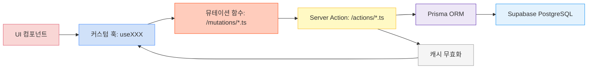

# Starglow 데이터 플로우

이 문서는 Starglow 애플리케이션의 데이터 흐름을 상세히 설명합니다.

## 전체 데이터 흐름 개요

Starglow는 다음과 같은 방식으로 데이터를 관리합니다:

```
UI 컴포넌트 → 커스텀 훅 → 쿼리/뮤테이션 → 서버 액션 → 데이터베이스
```

## 세부 데이터 흐름

### 1. 데이터 조회 흐름 (Read)

```mermaid
graph LR
    A[UI 컴포넌트] --> B[커스텀 훅: useXXX]
    B --> C[쿼리 함수: /queries/*.ts]
    C --> D[Server Action: /actions/*.ts]
    D --> E[Prisma ORM]
    E --> F[Supabase PostgreSQL]
    F --> E
    E --> D
    D --> C
    C --> B
    B --> A

    style A fill:#f9d6d5,stroke:#e06377
    style B fill:#d0e1f9,stroke:#4d90fe
    style C fill:#c8e6c9,stroke:#4caf50
    style D fill:#fff9c4,stroke:#fbc02d
    style E fill:#ede7f6,stroke:#673ab7
    style F fill:#e3f2fd,stroke:#2196f3
```



1. **UI 컴포넌트**에서 데이터가 필요할 때 훅을 호출
2. **커스텀 훅**이 TanStack Query를 사용하여 `queries` 디렉토리의 쿼리 함수 호출
3. **쿼리 함수**는 Server Action 호출
4. **Server Action**이 Prisma ORM을 통해 데이터베이스 접근
5. 데이터가 UI로 반환되고 TanStack Query가 캐싱 관리

### 2. 데이터 수정 흐름 (Create/Update/Delete)



1. **UI 컴포넌트**에서 데이터 변경 액션 발생
2. **커스텀 훅**이 `mutations` 디렉토리의 뮤테이션 함수 호출
3. **뮤테이션 함수**는 Server Action 호출
4. **Server Action**이 Prisma ORM을 통해 데이터베이스 수정
5. 성공 시 관련 쿼리 캐시 무효화
6. UI가 새로운 데이터로 자동 업데이트

## 전체 코드 흐름 예시: 사용자 프로필

아래 예시는 사용자 프로필을 불러오고 업데이트하는 전체 흐름을 보여줍니다:

### 1. UI 컴포넌트 (app/components/UserProfile.tsx)

```tsx
import { useUser, useUpdateUser } from "@/app/hooks/useUser";
import { useState } from "react";

export function UserProfile({ userId }: { userId: string }) {
  const { data: user, isLoading, error } = useUser(userId);
  const { mutate: updateUser, isPending } = useUpdateUser();
  const [name, setName] = useState("");

  if (isLoading) return <div>로딩 중...</div>;
  if (error) return <div>에러: {error.message}</div>;

  const handleSubmit = (e: React.FormEvent) => {
    e.preventDefault();
    updateUser({ id: userId, name });
  };

  return (
    <div className="p-4 border rounded-lg">
      <h2 className="text-xl font-bold mb-4">사용자 프로필</h2>
      <div className="mb-4">
        <p>이름: {user.name}</p>
        <p>이메일: {user.email}</p>
      </div>

      <form onSubmit={handleSubmit}>
        <input
          type="text"
          value={name}
          onChange={(e) => setName(e.target.value)}
          placeholder="새 이름"
          className="border p-2 rounded w-full mb-2"
        />
        <button
          type="submit"
          disabled={isPending}
          className="bg-blue-500 text-white p-2 rounded"
        >
          {isPending ? "업데이트 중..." : "이름 업데이트"}
        </button>
      </form>
    </div>
  );
}
```

### 2. 커스텀 훅 (app/hooks/useUser.ts)

```tsx
import { useQuery, useMutation, useQueryClient } from "@tanstack/react-query";
import { fetchUser } from "@/app/queries/userQueries";
import { updateUser as updateUserMutation } from "@/app/mutations/userMutations";
import { QUERY_KEYS } from "@/app/queryKeys";

export function useUser(userId: string) {
  return useQuery({
    queryKey: [QUERY_KEYS.USERS, userId],
    queryFn: () => fetchUser(userId),
    // 30분 동안 데이터 유지
    staleTime: 1000 * 60 * 30,
  });
}

export function useUpdateUser() {
  const queryClient = useQueryClient();

  return useMutation({
    mutationFn: updateUserMutation,
    onSuccess: (data, variables) => {
      // 성공 시 캐시 무효화
      queryClient.invalidateQueries({
        queryKey: [QUERY_KEYS.USERS, variables.id],
      });

      // 선택적: 새 데이터로 캐시 업데이트하여 즉시 UI 업데이트
      queryClient.setQueryData([QUERY_KEYS.USERS, variables.id], (oldData) => ({
        ...oldData,
        ...data,
      }));
    },
  });
}
```

### 3. 쿼리 함수 (app/queries/userQueries.ts)

```tsx
import { getUserById } from "@/app/actions/users";

export async function fetchUser(userId: string) {
  // 안전 장치: 유효한 userId가 아닌 경우 에러 발생
  if (!userId) {
    throw new Error("유효하지 않은 사용자 ID");
  }

  try {
    const user = await getUserById(userId);

    if (!user) {
      throw new Error("사용자를 찾을 수 없습니다");
    }

    return user;
  } catch (error) {
    console.error("사용자 조회 오류:", error);
    throw error;
  }
}
```

### 4. 뮤테이션 함수 (app/mutations/userMutations.ts)

```tsx
import { updateUserAction } from "@/app/actions/users";
import { z } from "zod";

// 입력 유효성 검증 스키마
const UpdateUserSchema = z.object({
  id: z.string().min(1, "ID는 필수 항목입니다"),
  name: z.string().min(1, "이름은 필수 항목입니다"),
  email: z.string().email().optional(),
});

export type UpdateUserInput = z.infer<typeof UpdateUserSchema>;

export async function updateUser(data: UpdateUserInput) {
  // 클라이언트 측 유효성 검증
  try {
    UpdateUserSchema.parse(data);
  } catch (error) {
    console.error("유효성 검증 실패:", error);
    throw error;
  }

  try {
    return await updateUserAction(data);
  } catch (error) {
    console.error("사용자 업데이트 오류:", error);
    throw error;
  }
}
```

### 5. 서버 액션 (app/actions/users.ts)

```tsx
"use server";

import { db } from "@/lib/db";
import { z } from "zod";
import { revalidatePath } from "next/cache";
import { auth } from "@/lib/auth";

// 서버 측 유효성 검증 스키마
const UpdateUserSchema = z.object({
  id: z.string().min(1),
  name: z.string().min(1),
  email: z.string().email().optional(),
});

export async function getUserById(id: string) {
  try {
    return await db.user.findUnique({
      where: { id },
    });
  } catch (error) {
    console.error("사용자 조회 오류:", error);
    throw new Error("사용자 조회 중 오류가 발생했습니다");
  }
}

export async function updateUserAction(data: {
  id: string;
  name: string;
  email?: string;
}) {
  // 서버 측 유효성 검증
  try {
    UpdateUserSchema.parse(data);
  } catch (error) {
    throw new Error("유효하지 않은 사용자 데이터");
  }

  // 인증 확인
  const session = await auth();
  if (!session || session.user.id !== data.id) {
    throw new Error("권한이 없습니다");
  }

  try {
    const updatedUser = await db.user.update({
      where: { id: data.id },
      data: {
        name: data.name,
        ...(data.email && { email: data.email }),
      },
    });

    // Next.js 캐시 무효화
    revalidatePath(`/profile/${data.id}`);

    return updatedUser;
  } catch (error) {
    console.error("사용자 업데이트 오류:", error);
    throw new Error("사용자 업데이트 중 오류가 발생했습니다");
  }
}
```

### 6. 쿼리 키 (app/queryKeys.ts)

```tsx
export const QUERY_KEYS = {
  USERS: "users",
  PLAYERS: "players",
  QUESTS: "quests",
  POLLS: "polls",
  EVENTS: "events",
  FILES: "files",
} as const;
```

## 파일 구조별 역할

### 1. `/app/components`

- 프레젠테이션 레이어
- UI 컴포넌트는 비즈니스 로직을 직접 다루지 않음
- 커스텀 훅을 통해 데이터 접근

```tsx
// 예시: app/components/UserProfile.tsx
export function UserProfile({ userId }: { userId: string }) {
  const { user, isLoading, error } = useUser(userId);

  if (isLoading) return <LoadingSpinner />;
  if (error) return <ErrorMessage error={error} />;

  return <div>{user.name}</div>;
}
```

### 2. `/app/hooks`

- UI와 데이터 레이어 연결
- 데이터 상태 관리 (로딩, 에러, 성공)
- React 상태 및 라이프사이클 관리

```tsx
// 예시: app/hooks/useUser.ts
export function useUser(userId: string) {
  return useQuery({
    queryKey: [QUERY_KEYS.USERS, userId],
    queryFn: () => fetchUser(userId),
  });
}

export function useUpdateUser() {
  const queryClient = useQueryClient();

  return useMutation({
    mutationFn: updateUser,
    onSuccess: (data, variables) => {
      queryClient.invalidateQueries({
        queryKey: [QUERY_KEYS.USERS, variables.id],
      });
    },
  });
}
```

### 3. `/app/queries`

- 데이터 조회 로직
- TanStack Query와 함께 사용
- 캐싱 및 데이터 패칭 최적화

```tsx
// 예시: app/queries/userQueries.ts
export async function fetchUser(userId: string) {
  return getUserById(userId);
}

export async function fetchUsers(filters?: UserFilters) {
  return getUsers(filters);
}
```

### 4. `/app/mutations`

- 데이터 변경 로직
- 캐시 무효화 관리
- 서버 액션 호출

```tsx
// 예시: app/mutations/userMutations.ts
export async function updateUser(data: UpdateUserInput) {
  return updateUserAction(data);
}

export async function createUser(data: CreateUserInput) {
  return createUserAction(data);
}
```

### 5. `/app/actions`

- 서버 사이드 로직
- 데이터베이스 CRUD 작업
- 유효성 검증 및 비즈니스 로직

```tsx
// 예시: app/actions/users.ts
"use server";

import { db } from "@/lib/db";

export async function getUserById(id: string) {
  return db.user.findUnique({
    where: { id },
  });
}

export async function updateUserAction(data: UpdateUserInput) {
  // 유효성 검증
  // 비즈니스 로직
  return db.user.update({
    where: { id: data.id },
    data: { name: data.name, email: data.email },
  });
}
```

## 데이터 흐름 예시

### 사용자 프로필 조회 및 수정

1. 사용자가 프로필 페이지 방문

   - `useUser` 훅이 호출됨
   - `fetchUser` 쿼리 함수 실행
   - `getUserById` 서버 액션이 데이터베이스 조회
   - 결과가 UI에 렌더링

2. 사용자가 프로필 업데이트
   - `useUpdateUser` 훅의 `mutate` 함수 호출
   - `updateUser` 뮤테이션 함수 실행
   - `updateUserAction` 서버 액션이 데이터베이스 업데이트
   - 성공 시 `users` 쿼리 캐시 무효화
   - UI가 새 데이터로 자동 업데이트

## 성능 최적화 팁

1. **쿼리 키 설계**: 정확한 캐시 무효화를 위해 세분화된 쿼리 키 사용

   ```tsx
   // 좋은 예: 세분화된 쿼리 키
   [QUERY_KEYS.USERS, userId];

   // 그룹 쿼리 무효화도 가능
   queryClient.invalidateQueries({ queryKey: [QUERY_KEYS.USERS] });
   ```

2. **캐시 스테일 타임 조정**: 자주 변경되지 않는 데이터는 staleTime 증가

   ```tsx
   useQuery({
     queryKey: [QUERY_KEYS.USERS, userId],
     queryFn: () => fetchUser(userId),
     staleTime: 1000 * 60 * 5, // 5분
   });
   ```

3. **선택적 쿼리 사용**: 필요한 경우에만 쿼리 실행

   ```tsx
   useQuery({
     queryKey: [QUERY_KEYS.USERS, userId],
     queryFn: () => fetchUser(userId),
     enabled: !!userId, // userId가 있을 때만 실행
   });
   ```

4. **서버 액션 캐싱**: 서버 액션에서 `revalidatePath`와 `revalidateTag` 활용
   ```tsx
   export async function updateUserAction(data: UpdateUserInput) {
     await db.user.update({ ... });
     revalidatePath(`/profile/${data.id}`);
     return updatedUser;
   }
   ```

## 주의사항 및 모범 사례

1. **캐시 무효화** - 데이터 변경 시 관련 쿼리 캐시 무효화하기
2. **에러 처리** - 모든 레이어에서 적절한 에러 처리 구현
3. **타입 안전성** - 모든 데이터 흐름에 TypeScript 타입 적용
4. **최적화** - 필요한 데이터만 요청하고 불필요한 리렌더링 방지
5. **서버 측 유효성 검증** - 클라이언트 유효성 검증은 UX용, 서버 검증은 필수
