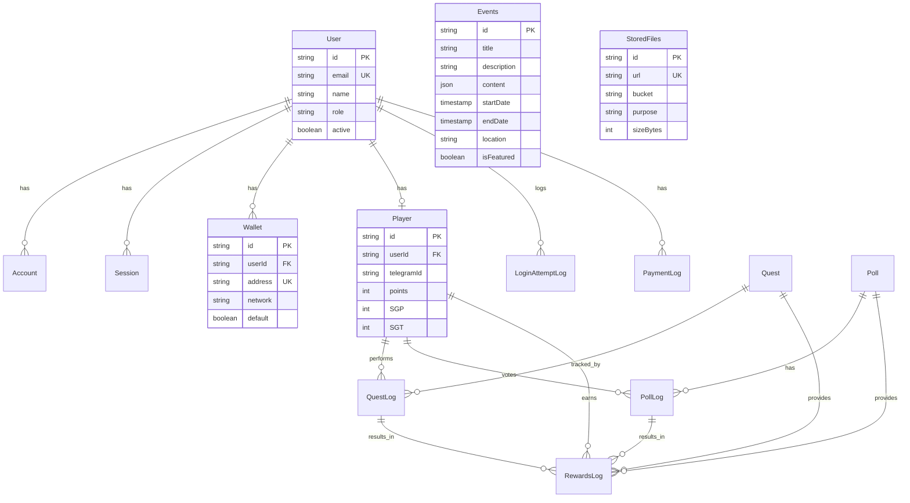
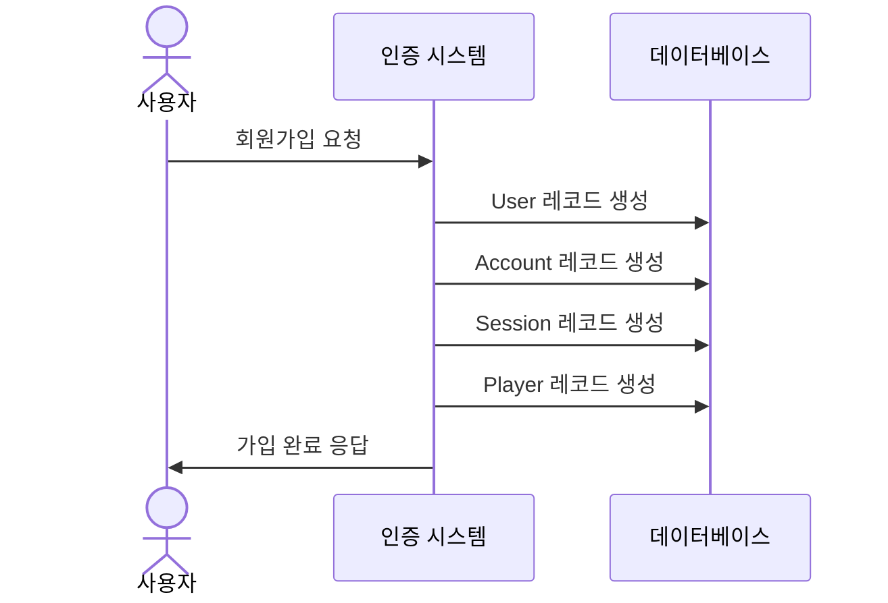
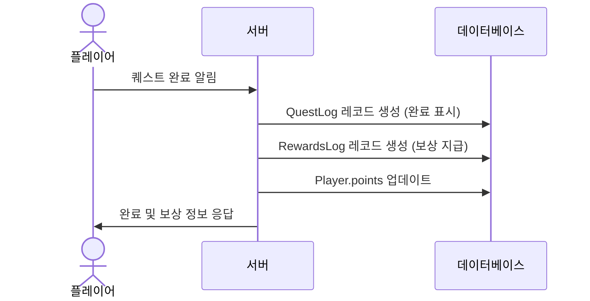

# 데이터베이스 스키마

Starglow 프로젝트는 Prisma ORM을 사용하여 Supabase(PostgreSQL)와 통신합니다. 이 문서는 데이터베이스 구조를 설명합니다.

## ER 다이어그램

GitHub Actions은 매일 스키마 시각화를 자동으로 생성합니다. 최신 버전은 [여기](https://your-organization.github.io/starglow/)에서 확인할 수 있습니다.

아래는 주요 엔티티 간의 관계를 보여주는 다이어그램입니다:



## 주요 모델 개요

### 사용자 관련 모델

- **User**: 시스템의 사용자 정보
- **Account**: 외부 제공자 인증 계정 (OAuth)
- **Session**: 사용자 세션 정보
- **Wallet**: 사용자의 암호화폐 지갑 정보

### 게임화 모델

- **Player**: 게임화 시스템 내의 사용자 프로필
- **Quest**: 완료할 수 있는 미션/퀘스트 정의
- **QuestLog**: 플레이어의 퀘스트 완료 기록
- **Poll**: 투표 및 베팅 이벤트
- **PollLog**: 플레이어의 투표/베팅 기록
- **RewardsLog**: 플레이어가 받은 보상 기록

### 이벤트 및 콘텐츠 모델

- **Events**: 콘서트, 팬미팅 등의 이벤트 정보
- **StoredFiles**: 파일 저장소 정보 (Vercel Blob)

### 로깅 및 결제 모델

- **LoginAttemptLog**: 로그인 시도 기록
- **PaymentLog**: 결제 기록
- **ExchangeRate**: 환율 정보

## 데이터 흐름 시나리오

다음은 주요 비즈니스 시나리오에서 데이터가 어떻게 흐르는지 보여줍니다:

### 시나리오 1: 사용자 가입 및 플레이어 생성



### 시나리오 2: 퀘스트 완료 및 보상 지급



## 상세 스키마

### User

| 필드          | 타입      | 설명                       |
| ------------- | --------- | -------------------------- |
| id            | String    | 기본 키 (cuid)             |
| name          | String?   | 사용자 이름                |
| email         | String?   | 이메일 주소 (고유)         |
| emailVerified | DateTime? | 이메일 인증 시간           |
| image         | String?   | 프로필 이미지 URL          |
| role          | String    | 권한 역할 (기본값: "user") |
| active        | Boolean   | 계정 활성화 상태           |
| createdAt     | DateTime  | 계정 생성 시간             |
| lastLoginAt   | DateTime? | 마지막 로그인 시간         |

### Player

| 필드              | 타입     | 설명                  |
| ----------------- | -------- | --------------------- |
| id                | String   | 기본 키 (cuid)        |
| userId            | String?  | User 외래 키 (고유)   |
| telegramId        | String?  | 텔레그램 ID (고유)    |
| name              | String?  | 플레이어 이름         |
| points            | Int      | 포인트 (기본값: 0)    |
| SGP               | Int      | SGP 토큰 (기본값: 0)  |
| SGT               | Int      | SGT 토큰 (기본값: 0)  |
| recommendedCount  | Int      | 추천인 수 (기본값: 0) |
| recommenderId     | String?  | 추천인 ID             |
| recommenderName   | String?  | 추천인 이름           |
| recommenderMethod | String?  | 추천 방법             |
| createdAt         | DateTime | 생성 시간             |
| lastConnectedAt   | DateTime | 마지막 접속 시간      |

### Quest

| 필드           | 타입           | 설명                       |
| -------------- | -------------- | -------------------------- |
| id             | String         | 기본 키 (cuid)             |
| title          | String         | 퀘스트 제목                |
| description    | String?        | 설명                       |
| url            | String?        | 관련 URL                   |
| icon           | String?        | 아이콘                     |
| rewards        | Int            | 보상 수량 (기본값: 800)    |
| rewardCurrency | RewardCurrency | 보상 통화 (기본값: points) |
| startDate      | DateTime?      | 시작 날짜                  |
| endDate        | DateTime?      | 종료 날짜                  |
| permanent      | Boolean        | 영구 퀘스트 여부           |
| visible        | Boolean        | 표시 여부                  |
| primary        | Int?           | 정렬 순서                  |
| effects        | String?        | className 효과 정보        |
| type           | String?        | 퀘스트 유형                |

### Poll

| 필드                    | 타입     | 설명                |
| ----------------------- | -------- | ------------------- |
| id                      | String   | 기본 키 (cuid)      |
| title                   | String   | 투표 제목           |
| titleShorten            | String?  | 짧은 제목           |
| options                 | String[] | 옵션 목록           |
| optionsShorten          | String[] | 짧은 옵션 목록      |
| bannerImg               | String?  | 배너 이미지         |
| startDate               | DateTime | 시작 시간           |
| endDate                 | DateTime | 종료 시간           |
| exposeInScheduleTab     | Boolean  | 스케줄 탭 노출 여부 |
| totalVotes              | Int      | 총 투표 수          |
| totalVotesByOption      | Int[]    | 옵션별 투표 수      |
| totalBetsAmount         | Int      | 총 베팅 금액        |
| totalBetsAmountByOption | Int[]    | 옵션별 베팅 금액    |
| results                 | Int[]    | 결과 배열           |

## 코드 사용 예시

### 1. Prisma 스키마 (prisma/schema.prisma)

```prisma
model User {
  id            String            @id @default(cuid())
  name          String?
  email         String?           @unique
  emailVerified DateTime?
  image         String?
  role          String            @default("user")
  active        Boolean           @default(true)
  createdAt     DateTime          @default(now())
  lastLoginAt   DateTime?
  accounts      Account[]
  loginAttempts LoginAttemptLog[] @relation("UserLoginAttempts")
  paymentLogs   PaymentLog[]
  player        Player?
  sessions      Session[]
  wallets       Wallet[]

  @@index([email, active])
  @@index([role, active])
  @@index([lastLoginAt])
}

model Player {
  id                String       @id @default(cuid())
  userId            String?      @unique
  telegramId        String?      @unique
  name              String?
  points            Int          @default(0)
  SGP               Int          @default(0)
  SGT               Int          @default(0)
  recommendedCount  Int          @default(0)
  recommenderId     String?
  recommenderName   String?
  recommenderMethod String?
  createdAt         DateTime     @default(now())
  lastConnectedAt   DateTime     @updatedAt
  user              User?        @relation(fields: [userId], references: [id], onDelete: Cascade)
  pollLogs          PollLog[]
  questLogs         QuestLog[]
  rewardLogs        RewardsLog[]

  @@index([userId, telegramId])
  @@index([points, SGP, SGT])
  @@index([recommenderId])
}
```

### 2. 서버 액션에서 사용 예시 (app/actions/playerActions.ts)

```typescript
"use server";

import { db } from "@/lib/db";
import { auth } from "@/lib/auth";
import { revalidatePath } from "next/cache";

// 플레이어 정보 조회
export async function getPlayerProfile() {
  const session = await auth();
  if (!session?.user?.id) {
    throw new Error("인증되지 않은 사용자");
  }

  const player = await db.player.findUnique({
    where: {
      userId: session.user.id,
    },
    include: {
      user: {
        select: {
          name: true,
          email: true,
          image: true,
        },
      },
    },
  });

  if (!player) {
    throw new Error("플레이어 정보를 찾을 수 없습니다");
  }

  return player;
}

// 플레이어 포인트 추가
export async function addPlayerPoints(playerId: string, points: number) {
  const session = await auth();
  if (!session?.user?.id) {
    throw new Error("인증되지 않은 사용자");
  }

  // 관리자 또는 본인 확인
  const player = await db.player.findUnique({
    where: { id: playerId },
    select: { userId: true },
  });

  if (
    !player ||
    (player.userId !== session.user.id && session.user.role !== "admin")
  ) {
    throw new Error("권한이 없습니다");
  }

  // 트랜잭션으로 포인트 추가 및 로그 기록
  const updatedPlayer = await db.$transaction(async (tx) => {
    // 플레이어 포인트 업데이트
    const updated = await tx.player.update({
      where: { id: playerId },
      data: {
        points: { increment: points },
      },
    });

    // 보상 로그 기록
    await tx.rewardsLog.create({
      data: {
        playerId,
        amount: points,
        currency: "points",
        reason: "관리자에 의한 수동 지급",
      },
    });

    return updated;
  });

  revalidatePath(`/profile/${playerId}`);
  return updatedPlayer;
}
```

### 3. 쿼리에서 사용 예시 (app/queries/playerQueries.ts)

```typescript
import {
  getPlayerProfile,
  getPlayerQuests,
  getPlayerPolls,
} from "@/app/actions/playerActions";

// 플레이어 프로필 조회
export async function fetchPlayerProfile() {
  return getPlayerProfile();
}

// 플레이어의 퀘스트 완료 상태 조회
export async function fetchPlayerQuests() {
  const playerProfile = await getPlayerProfile();
  return getPlayerQuests(playerProfile.id);
}

// 플레이어의 투표 참여 이력 조회
export async function fetchPlayerPolls() {
  const playerProfile = await getPlayerProfile();
  return getPlayerPolls(playerProfile.id);
}
```

## 주요 관계

1. **User-Player** (1:1): 각 User는 하나의 Player 프로필을 가질 수 있음
2. **Player-QuestLog** (1:N): Player는 여러 Quest를 완료할 수 있음
3. **Player-PollLog** (1:N): Player는 여러 Poll에 투표할 수 있음
4. **Quest-QuestLog** (1:N): 하나의 Quest는 여러 Player에 의해 완료될 수 있음
5. **Poll-PollLog** (1:N): 하나의 Poll은 여러 Player의 투표를 받을 수 있음
6. **RewardsLog** 관계: Player가 받는 보상은 Quest, QuestLog, Poll, PollLog와 연결됨

## 복합 쿼리 예시

다음은 실제 비즈니스 로직에서 사용될 수 있는 복합 쿼리의 예시입니다:

### 1. 추천인 기반 플레이어 조회

```typescript
const playersWithReferrals = await db.player.findMany({
  where: {
    recommenderId: playerId,
  },
  select: {
    id: true,
    name: true,
    createdAt: true,
    points: true,
    user: {
      select: {
        email: true,
      },
    },
  },
  orderBy: {
    createdAt: "desc",
  },
});
```

### 2. 활성 퀘스트 조회

```typescript
const activeQuests = await db.quest.findMany({
  where: {
    OR: [
      { permanent: true },
      {
        AND: [
          { startDate: { lte: new Date() } },
          { endDate: { gte: new Date() } },
        ],
      },
    ],
    visible: true,
  },
  orderBy: [{ primary: "desc" }, { createdAt: "desc" }],
  include: {
    questLogs: {
      where: {
        playerId,
        completed: true,
      },
    },
  },
});
```

## Enum 타입

### RewardCurrency

- points
- SGP
- SGT

### EventCategory

- concert
- fanmeeting
- fancamp
- festival
- exhibition
- other

### EventStatus

- upcoming
- ongoing
- completed
- cancelled

### PaymentStatus

- INIT
- COMPLETED
- CANCELLED
- FAILED
- REFUNDED

## 인덱스 전략

주요 조회 패턴을 지원하기 위한 인덱스가 설정되어 있습니다:

- User 테이블: email+active, role+active, lastLoginAt
- Player 테이블: userId+telegramId, points+SGP+SGT
- Quest 테이블: permanent+visible+startDate, type+visible
- Poll 테이블: startDate+endDate+exposeInScheduleTab
- RewardsLog 테이블: playerId+currency+createdAt

## 성능 최적화 팁

1. **올바른 인덱스 사용**: 자주 필터링하는 필드에 인덱스 설정

   ```prisma
   @@index([userId, telegramId])
   ```

2. **필요한 필드만 선택**: `select` 절을 사용하여 필요한 필드만 가져오기

   ```typescript
   const users = await db.user.findMany({
     select: {
       id: true,
       name: true,
       email: true,
     },
   });
   ```

3. **관계 데이터 지연 로딩**: 필요한 관계만 `include`하기

   ```typescript
   const userWithoutRelations = await db.user.findUnique({
     where: { id },
   });

   // 필요할 때만 관계 데이터 조회
   const userWithPlayer = await db.user.findUnique({
     where: { id },
     include: {
       player: true,
     },
   });
   ```

4. **배치 작업 사용**: 여러 작업을 한 번의 트랜잭션으로 처리
   ```typescript
   await db.$transaction([
     db.user.update(...),
     db.player.update(...),
     db.rewardsLog.create(...),
   ]);
   ```

## 데이터 무결성

모든 관계는 적절한 외래 키 제약 조건으로 보호됩니다. 대부분의 관계는 부모 레코드가 삭제될 때 연결된 자식 레코드도 함께 삭제되는 CASCADE 옵션을 사용합니다.
