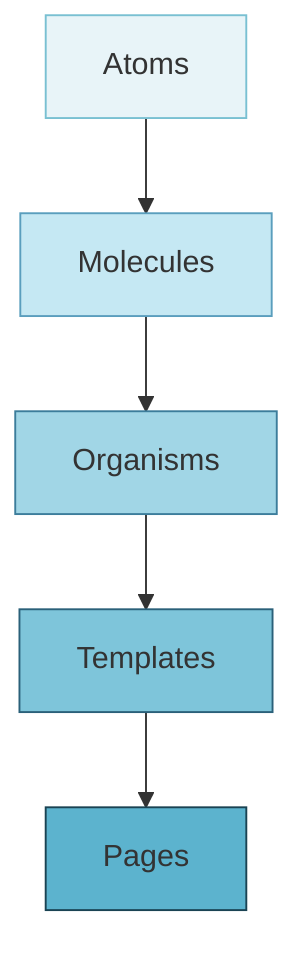
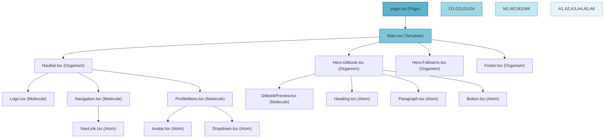
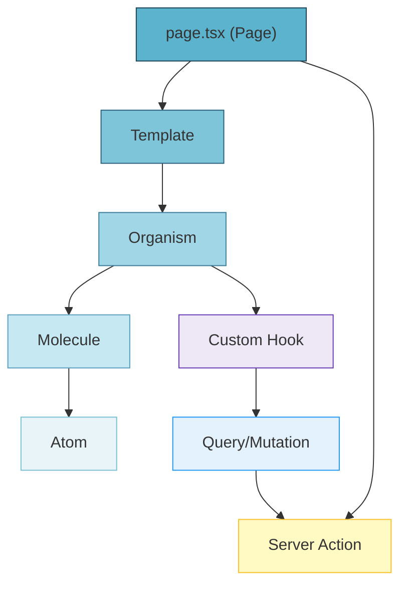
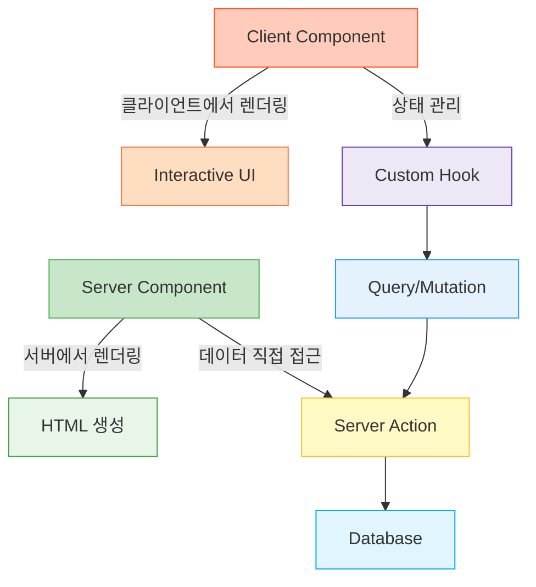
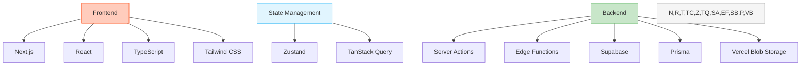

# 프론트엔드 구조

Starglow 프론트엔드는 Atomic Design 패턴을 적용하여 컴포넌트를 계층적으로 구성합니다. 이 문서는 프론트엔드 아키텍처와 컴포넌트 구조를 설명합니다.

## Atomic Design 패턴

Atomic Design은 UI 컴포넌트를 화학적 관점에서 계층적으로 구성하는 방법론입니다. 이 패턴은 Brad Frost에 의해 소개되었으며, UI 요소를 원자(Atoms), 분자(Molecules), 유기체(Organisms), 템플릿(Templates), 페이지(Pages)의 5단계로 분류합니다.



### 1. Atoms (원자)

가장 기본적인 UI 빌딩 블록으로, 더 이상 분해할 수 없는 요소입니다.

- **특징**: 단일 책임, 고도의 재사용성
- **예시**: 버튼, 입력 필드, 아이콘, 라벨, 제목, 텍스트 등
- **구체적 예**: `Button.tsx`, `Input.tsx`, `Icon.tsx`, `Heading.tsx`

```tsx
// components/atoms/Button.tsx
import { ButtonHTMLAttributes, forwardRef } from "react";
import { cn } from "@/lib/utils";

interface ButtonProps extends ButtonHTMLAttributes<HTMLButtonElement> {
  variant?: "primary" | "secondary" | "outline" | "ghost";
  size?: "sm" | "md" | "lg";
}

const Button = forwardRef<HTMLButtonElement, ButtonProps>(
  (
    { className, variant = "primary", size = "md", children, ...props },
    ref
  ) => (
    <button
      ref={ref}
      className={cn(
        "rounded-md font-medium transition-colors focus:outline-none",
        {
          "bg-blue-600 text-white hover:bg-blue-700": variant === "primary",
          "bg-gray-200 text-gray-800 hover:bg-gray-300":
            variant === "secondary",
          "border border-gray-300 hover:bg-gray-100": variant === "outline",
          "hover:bg-gray-100": variant === "ghost",
          "px-2 py-1 text-sm": size === "sm",
          "px-4 py-2": size === "md",
          "px-6 py-3 text-lg": size === "lg",
        },
        className
      )}
      {...props}
    >
      {children}
    </button>
  )
);

Button.displayName = "Button";

export default Button;
```

### 2. Molecules (분자)

여러 Atom을 결합하여 만든 단순하지만 의미있는 UI 요소입니다.

- **특징**: 단일 기능에 중점, 중간 수준의 재사용성
- **예시**: 검색 폼, 메뉴 항목, 카드 헤더, 알림 메시지 등
- **구체적 예**: `SearchForm.tsx`, `MenuItem.tsx`, `CardHeader.tsx`, `Alert.tsx`

```tsx
// components/molecules/SearchForm.tsx
import { useState } from "react";
import Input from "@/components/atoms/Input";
import Button from "@/components/atoms/Button";
import Icon from "@/components/atoms/Icon";

interface SearchFormProps {
  onSearch: (query: string) => void;
  placeholder?: string;
}

export default function SearchForm({
  onSearch,
  placeholder = "Search...",
}: SearchFormProps) {
  const [query, setQuery] = useState("");

  const handleSubmit = (e: React.FormEvent) => {
    e.preventDefault();
    if (query.trim()) onSearch(query);
  };

  return (
    <form onSubmit={handleSubmit} className="flex items-center">
      <Input
        value={query}
        onChange={(e) => setQuery(e.target.value)}
        placeholder={placeholder}
        className="rounded-r-none"
      />
      <Button type="submit" variant="primary" className="rounded-l-none">
        <Icon name="search" size={16} />
      </Button>
    </form>
  );
}
```

### 3. Organisms (유기체)

상대적으로 복잡하고 뚜렷한 UI 섹션으로, 여러 Molecule과 Atom으로 구성됩니다.

- **특징**: 특정 맥락에서 작동, 특정 섹션의 완전한 기능 제공
- **예시**: 헤더, 푸터, 폼, 사이드바, 플레이어 프로필 등
- **구체적 예**: `NavBar.tsx`, `Footer.tsx`, `QuestList.tsx`, `ProfileCard.tsx`

```tsx
// components/organisms/NavBar.tsx
import Logo from "@/components/molecules/Logo";
import Navigation from "@/components/molecules/Navigation";
import SearchForm from "@/components/molecules/SearchForm";
import ProfileMenu from "@/components/molecules/ProfileMenu";

export default function NavBar() {
  const handleSearch = (query: string) => {
    // 검색 처리 로직
    console.log("Searching for:", query);
  };

  return (
    <nav className="flex items-center justify-between px-6 py-4 bg-white shadow-sm">
      <div className="flex items-center">
        <Logo />
        <Navigation className="ml-8" />
      </div>

      <div className="flex items-center">
        <SearchForm onSearch={handleSearch} className="mr-4" />
        <ProfileMenu />
      </div>
    </nav>
  );
}
```

### 4. Templates (템플릿)

페이지의 구조를 정의하며, 여러 Organism을 배치합니다.

- **특징**: 레이아웃에 중점, Organism 및 Molecule 배치
- **예시**: 홈페이지 템플릿, 대시보드 템플릿, 상세 페이지 템플릿 등
- **구체적 예**: `Main.tsx`, `Dashboard.tsx`, `ProfilePageTemplate.tsx`

```tsx
// components/templates/Main.tsx
import NavBar from "@/components/organisms/NavBar";
import HeroGitbook from "@/components/organisms/Hero.Gitbook";
import HeroFollowUs from "@/components/organisms/Hero.FollowUs";
import Footer from "@/components/organisms/Footer";
import Image from "next/image";

export default function Main() {
  return (
    <div className="relative flex flex-col w-full">
      

      <div className="sticky top-0 z-10 backdrop-blur-md">
        <NavBar />
      </div>
      <main className="flex flex-col flex-1">
        <HeroGitbook />
        <HeroFollowUs />
      </main>
      <Footer followUsMinimal={true} />
    </div>
  );
}
```

### 5. Pages (페이지)

실제 콘텐츠가 적용된 완성된 페이지입니다. Next.js의 app 디렉토리의 page.tsx 파일이 이에 해당합니다.

- **특징**: 완성된 UI 페이지, 템플릿에 실제 데이터 적용
- **예시**: 홈페이지, 대시보드 페이지, 사용자 프로필 페이지 등
- **구체적 예**: `page.tsx`, `dashboard/page.tsx`, `profile/[id]/page.tsx`

```tsx
// app/page.tsx
import Main from "@/components/templates/Main";

export default function HomePage() {
  return (
    <div>
      <main>
        <Main />
      </main>
    </div>
  );
}
```

## 디렉토리 구조

Starglow 프로젝트는 다음과 같은 디렉토리 구조를 따릅니다:

```
components/
├── atoms/        # 기본 UI 요소
│   ├── Button.tsx
│   ├── Input.tsx
│   ├── Icon.tsx
│   └── ...
│
├── molecules/    # 복합 UI 요소
│   ├── SearchBar.tsx
│   ├── MenuItem.tsx
│   ├── Card.tsx
│   └── ...
│
├── organisms/    # 복잡한 UI 섹션
│   ├── NavBar.tsx
│   ├── Footer.tsx
│   ├── Hero.Gitbook.tsx
│   ├── Hero.FollowUs.tsx
│   └── ...
│
└── templates/    # 페이지 레이아웃
    ├── Main.tsx
    ├── Dashboard.tsx
    └── ...

app/
└── (routes)/     # Next.js 페이지
    ├── page.tsx             # 홈 페이지
    ├── dashboard/page.tsx   # 대시보드 페이지
    ├── events/page.tsx      # 이벤트 페이지
    └── ...
```

## 실제 예시: 컴포넌트 분석

### Hero.Gitbook 컴포넌트 (Organism)

이 컴포넌트는 여러 Atom과 Molecule을 조합하여 하나의 복잡한 UI 섹션을 형성합니다:

```tsx
// components/organisms/Hero.Gitbook.tsx (예시)
import Button from "@/components/atoms/Button";
import Heading from "@/components/atoms/Heading";
import Paragraph from "@/components/atoms/Paragraph";
import GitbookPreview from "@/components/molecules/GitbookPreview";

export default function HeroGitbook() {
  return (
    <section className="container mx-auto py-20 px-4 flex flex-col lg:flex-row items-center justify-between">
      <div className="max-w-xl">
        <Heading level={1} className="text-4xl md:text-5xl font-bold mb-4">
          모든 프로젝트 문서를 한 곳에서
        </Heading>
        <Paragraph className="text-gray-600 mb-8">
          Starglow의 체계적인 문서화 시스템으로 팀 협업을 더욱 효율적으로
          만들어보세요. 상세한 API 문서, 가이드라인 및 팁을 한눈에 확인할 수
          있습니다.
        </Paragraph>
        <div className="flex space-x-4">
          <Button size="lg">문서 시작하기</Button>
          <Button variant="outline" size="lg">
            데모 보기
          </Button>
        </div>
      </div>

      <GitbookPreview className="mt-12 lg:mt-0" />
    </section>
  );
}
```

## 컴포넌트 흐름 예시

홈페이지의 컴포넌트 계층 구조는 다음과 같습니다:



## 페이지 계층 구조

### 1. 페이지 (app/page.tsx)

최상위 레벨의 컴포넌트로 Next.js의 페이지 라우팅의 진입점입니다.

```tsx
// app/page.tsx
import Main from "@/components/templates/Main";

export default function Home() {
  return (
    <div>
      <main>
        <Main />
      </main>
    </div>
  );
}
```

### 2. 템플릿 (components/templates/Main.tsx)

페이지의 전반적인 레이아웃을 정의하며, 여러 Organism을 조합합니다.

```tsx
// components/templates/Main.tsx
import NavBar from "@/components/organisms/NavBar";
import HeroGitbook from "@/components/organisms/Hero.Gitbook";
import HeroFollowUs from "@/components/organisms/Hero.FollowUs";
import Footer from "@/components/organisms/Footer";
import Image from "next/image";

export default function Main() {
  return (
    <div className="relative flex flex-col w-full">
      

      <div className="sticky top-0 z-10 backdrop-blur-md">
        <NavBar />
      </div>
      <main className="flex flex-col flex-1">
        <HeroGitbook />
        <HeroFollowUs />
      </main>
      <Footer followUsMinimal={true} />
    </div>
  );
}
```

### 3. 유기체 (components/organisms/NavBar.tsx)

여러 Molecule과 Atom을 조합한 복잡한 UI 섹션입니다.

```tsx
// components/organisms/NavBar.tsx (예시)
import Logo from "@/components/molecules/Logo";
import Navigation from "@/components/molecules/Navigation";
import ProfileMenu from "@/components/molecules/ProfileMenu";

export default function NavBar() {
  return (
    <nav className="flex items-center justify-between px-6 py-4">
      <Logo />
      <div className="flex items-center space-x-8">
        <Navigation />
        <ProfileMenu />
      </div>
    </nav>
  );
}
```

### 4. 분자 (components/molecules/Navigation.tsx)

여러 Atom을 조합한 UI 요소 그룹입니다.

```tsx
// components/molecules/Navigation.tsx (예시)
import NavLink from "@/components/atoms/NavLink";

export default function Navigation() {
  return (
    <div className="flex items-center space-x-6">
      <NavLink href="/dashboard">Dashboard</NavLink>
      <NavLink href="/events">Events</NavLink>
      <NavLink href="/quests">Quests</NavLink>
      <NavLink href="/polls">Polls</NavLink>
    </div>
  );
}
```

### 5. 원자 (components/atoms/NavLink.tsx)

가장 기본적인 UI 요소입니다.

```tsx
// components/atoms/NavLink.tsx (예시)
import Link from "next/link";
import { usePathname } from "next/navigation";

export default function NavLink({ href, children }) {
  const pathname = usePathname();
  const isActive = pathname === href;

  return (
    <Link
      href={href}
      className={`text-base font-medium transition-colors ${
        isActive ? "text-blue-500" : "text-gray-600 hover:text-gray-900"
      }`}
    >
      {children}
    </Link>
  );
}
```

## 데이터 흐름 통합

컴포넌트 계층에서 데이터 레이어와 통합하는 방법:



### Server Component vs. Client Component



1. **Server Components**:

   - 서버에서 렌더링되어 HTML로 전송
   - 데이터베이스에 직접 접근 가능
   - 주로 데이터 페칭 및 초기 렌더링

2. **Client Components**:
   - 클라이언트에서 인터랙티브한 UI 담당
   - 상태 관리 및 이벤트 핸들링
   - 'use client' 지시문으로 시작

## 예시: 인터랙티브 컴포넌트 (Client Component)

```tsx
"use client"; // 클라이언트 컴포넌트 선언

import { useState } from "react";
import { useQuests } from "@/app/hooks/useQuests";
import QuestItem from "@/components/molecules/QuestItem";
import Button from "@/components/atoms/Button";

export default function QuestList() {
  const { data: quests, isLoading } = useQuests();
  const [filter, setFilter] = useState("all");

  if (isLoading) return <div>로딩 중...</div>;

  const filteredQuests = quests.filter(
    (quest) => filter === "all" || quest.status === filter
  );

  return (
    <div className="space-y-4">
      <div className="flex space-x-2">
        <Button
          onClick={() => setFilter("all")}
          variant={filter === "all" ? "default" : "outline"}
        >
          모든 퀘스트
        </Button>
        <Button
          onClick={() => setFilter("active")}
          variant={filter === "active" ? "default" : "outline"}
        >
          진행 중
        </Button>
        <Button
          onClick={() => setFilter("completed")}
          variant={filter === "completed" ? "default" : "outline"}
        >
          완료됨
        </Button>
      </div>

      <div className="grid gap-4 md:grid-cols-2 lg:grid-cols-3">
        {filteredQuests.map((quest) => (
          <QuestItem key={quest.id} quest={quest} />
        ))}
      </div>
    </div>
  );
}
```

## 예시: 데이터 페칭 페이지 (Server Component)

```tsx
// app/quests/page.tsx (Server Component)
import { Suspense } from "react";
import { getQuests } from "@/app/actions/quests";
import QuestList from "@/components/organisms/QuestList";
import QuestListSkeleton from "@/components/organisms/QuestListSkeleton";

export default async function QuestsPage() {
  // Server Component에서 직접 데이터 페칭
  const quests = await getQuests();

  return (
    <div className="container mx-auto py-8">
      <h1 className="text-3xl font-bold mb-8">퀘스트</h1>

      <Suspense fallback={<QuestListSkeleton />}>
        <QuestList initialQuests={quests} />
      </Suspense>
    </div>
  );
}
```

## Atomic Design 적용의 장점

1. **일관성**: 디자인 시스템을 체계적으로 구축하여 UI 일관성 유지
2. **재사용성**: 작은 컴포넌트를 재사용하여 개발 효율성 증가
3. **유지보수성**: 각 컴포넌트의 책임이 명확하게 분리되어 유지보수 용이
4. **협업**: 디자이너와 개발자 간 커뮤니케이션 향상
5. **확장성**: 새로운 기능이나 페이지 추가가 용이

## Atomic Design 적용 시 주의사항

1. **적절한 분류**: 각 컴포넌트의 역할과 복잡성에 따라 적절한 계층 분류
2. **과도한 추상화 방지**: 불필요하게 많은 계층으로 분리하면 복잡성 증가
3. **컨텍스트 의존성**: Organism 이상 레벨에서는 특정 컨텍스트에 의존할 수 있음
4. **명확한 네이밍**: 각 컴포넌트의 역할과 책임을 명확히 하는 네이밍 필요

## 컴포넌트 설계 가이드라인

### 1. Atomic Design 원칙

- **단일 책임**: 각 컴포넌트는 하나의 책임만 가짐
- **계층적 구성**: 작은 단위에서 큰 단위로 구성
- **재사용성**: 낮은 레벨일수록 재사용성이 높도록 설계

### 2. 네이밍 규칙

| 컴포넌트 타입 | 네이밍 규칙  | 예시                        |
| ------------- | ------------ | --------------------------- |
| atoms         | 기능명.tsx   | Button.tsx, Input.tsx       |
| molecules     | 기능명.tsx   | SearchBar.tsx, MenuItem.tsx |
| organisms     | 영역명.tsx   | NavBar.tsx, Footer.tsx      |
| templates     | 페이지명.tsx | Main.tsx, Dashboard.tsx     |

### 3. Props 설계

- **명확한 타입 정의**: TypeScript 인터페이스로 props 타입 정의
- **기본값 제공**: 필요한 경우 기본값 제공
- **불필요한 props 전달 방지**: props destructuring 활용

```tsx
// 좋은 예시
interface ButtonProps {
  variant?: "primary" | "secondary";
  size?: "sm" | "md" | "lg";
  children: React.ReactNode;
  onClick?: () => void;
}

export default function Button({
  variant = "primary",
  size = "md",
  children,
  onClick,
}: ButtonProps) {
  // ...
}
```

### 4. 상태 관리 전략

- **로컬 상태**: 개별 컴포넌트 내부 상태는 `useState`
- **공유 상태**: 여러 컴포넌트 간 공유 상태는 Custom Hook
- **서버 상태**: TanStack Query + Server Actions
- **전역 상태**: Zustand

## 성능 최적화 팁

1. **컴포넌트 메모이제이션**: React.memo, useMemo, useCallback 활용
2. **이미지 최적화**: Next.js Image 컴포넌트 사용
3. **코드 분할**: 동적 import로 필요할 때만 로드
4. **서버 컴포넌트 활용**: 가능한 경우 Server Component 사용
5. **적절한 키 사용**: 리스트 렌더링 시 적절한 key 속성 부여

## Starglow 프로젝트의 기술 스택

Starglow 프로젝트는 다음과 같은 기술 스택을 사용합니다:



### 프론트엔드 기술

- **Next.js**: 서버 사이드 렌더링, 정적 사이트 생성, API 라우트 제공
- **React**: UI 컴포넌트 라이브러리
- **TypeScript**: 정적 타입 검사를 통한 안정적인 코드 작성
- **Tailwind CSS**: 유틸리티 기반 CSS 프레임워크

### 상태 관리

- **Zustand**: 간결하고 직관적인 전역 상태 관리 라이브러리
- **TanStack Query**: 서버 상태 관리 및 데이터 페칭 라이브러리

### 백엔드 기술

- **Server Actions**: Next.js의 서버 사이드 기능을 통한 데이터 처리
- **Edge Functions**: 필요한 경우 지연 시간을 최소화하는 엣지 컴퓨팅
- **Supabase**: 인증, 데이터베이스, 스토리지 등의 백엔드 서비스
- **Prisma**: 데이터베이스 ORM
- **Vercel Blob Storage**: 파일 저장소

## 데이터 흐름 아키텍처

Starglow 프로젝트는 명확한 데이터 흐름 아키텍처를 따릅니다:

```
app/
├── actions/          # 순수 서버 로직만
│   └── files.ts
│
├── queries/          # 데이터 가져오는 쿼리 함수 (캐싱용)
│   └── filesQueries.ts
│
├── mutations/        # 서버에 데이터 변경하는 뮤테이션 함수
│   └── filesMutations.ts
│
├── hooks/            # React 상태 및 로직 관리
│   ├── useFiles.ts
│   └── useToast.ts
│
├── queryKeys.ts      # 쿼리 키 정의
└── components/       # UI 컴포넌트
```

### 레이어별 책임

| 레이어         | 디렉토리   | 주요 책임                                    |
| -------------- | ---------- | -------------------------------------------- |
| Server Actions | actions/   | 데이터 CRUD 및 서버 로직만                   |
| Queries        | queries/   | 데이터 fetching 로직(캐싱 관리)              |
| Mutations      | mutations/ | 데이터 변경 작업(server 호출 후 캐시 무효화) |
| Hooks          | hooks/     | UI 상태 관리 및 Query, Mutation 연결         |

### 데이터 페칭 예시

실제 데이터 페칭과 상태 관리의 흐름은 다음과 같습니다:

1. **Server Action** 정의:

```tsx
// app/actions/quests.ts
"use server";

import { db } from "@/lib/db";

export async function getQuests() {
  return await db.quest.findMany({
    where: { isDeleted: false },
    orderBy: { createdAt: "desc" },
  });
}

export async function completeQuest(id: string) {
  return await db.quest.update({
    where: { id },
    data: { status: "COMPLETED", completedAt: new Date() },
  });
}
```

2. **Query 및 Mutation** 정의:

```tsx
// app/queries/questQueries.ts
import { getQuests } from "@/app/actions/quests";
import { questKeys } from "@/app/queryKeys";
import { useQuery } from "@tanstack/react-query";

export function useQuestsQuery() {
  return useQuery({
    queryKey: questKeys.all,
    queryFn: getQuests,
  });
}

// app/mutations/questMutations.ts
import { completeQuest } from "@/app/actions/quests";
import { questKeys } from "@/app/queryKeys";
import { useMutation, useQueryClient } from "@tanstack/react-query";

export function useCompleteQuestMutation() {
  const queryClient = useQueryClient();

  return useMutation({
    mutationFn: completeQuest,
    onSuccess: () => {
      queryClient.invalidateQueries({ queryKey: questKeys.all });
    },
  });
}
```

3. **Custom Hook** 정의:

```tsx
// app/hooks/useQuests.ts
import { useQuestsQuery } from "@/app/queries/questQueries";
import { useCompleteQuestMutation } from "@/app/mutations/questMutations";

export function useQuests() {
  const { data: quests, isLoading, error } = useQuestsQuery();
  const { mutate: completeQuest, isPending } = useCompleteQuestMutation();

  return {
    quests,
    isLoading,
    error,
    completeQuest,
    isCompleting: isPending,
  };
}
```

4. **UI 컴포넌트**에서 사용:

```tsx
// components/organisms/QuestList.tsx
"use client";

import { useQuests } from "@/app/hooks/useQuests";
import QuestItem from "@/components/molecules/QuestItem";

export default function QuestList() {
  const { quests, isLoading, completeQuest, isCompleting } = useQuests();

  if (isLoading) return <div>로딩 중...</div>;

  return (
    <div className="grid gap-4 md:grid-cols-2 lg:grid-cols-3">
      {quests.map((quest) => (
        <QuestItem
          key={quest.id}
          quest={quest}
          onComplete={() => completeQuest(quest.id)}
          isCompleting={isCompleting}
        />
      ))}
    </div>
  );
}
```

## 전역 상태 관리 (Zustand)

Zustand를 사용한 전역 상태 관리 예시:

```tsx
// lib/stores/useUserStore.ts
import { create } from "zustand";
import { persist } from "zustand/middleware";

interface UserState {
  user: User | null;
  isAuthenticated: boolean;
  setUser: (user: User | null) => void;
  logout: () => void;
}

export const useUserStore = create<UserState>()(
  persist(
    (set) => ({
      user: null,
      isAuthenticated: false,
      setUser: (user) => set({ user, isAuthenticated: !!user }),
      logout: () => set({ user: null, isAuthenticated: false }),
    }),
    { name: "user-storage" }
  )
);
```

## 성능 최적화 전략

### 1. 컴포넌트 메모이제이션

```tsx
// components/molecules/QuestItem.tsx
import { memo } from "react";

interface QuestItemProps {
  quest: Quest;
  onComplete: () => void;
  isCompleting: boolean;
}

function QuestItem({ quest, onComplete, isCompleting }: QuestItemProps) {
  // 컴포넌트 구현
}

// React.memo로 래핑하여 props가 변경되지 않으면 리렌더링하지 않음
export default memo(QuestItem);
```

### 2. 서버 컴포넌트 활용

```tsx
// app/dashboard/page.tsx (Server Component)
import { Suspense } from "react";
import { getStats } from "@/app/actions/stats";
import DashboardStats from "@/components/organisms/DashboardStats";
import DashboardStatsSkeleton from "@/components/organisms/DashboardStatsSkeleton";

export default async function DashboardPage() {
  // 서버에서 직접 데이터 페칭
  const stats = await getStats();

  return (
    <div className="container mx-auto py-8">
      <h1 className="text-3xl font-bold mb-8">대시보드</h1>

      <Suspense fallback={<DashboardStatsSkeleton />}>
        <DashboardStats initialStats={stats} />
      </Suspense>
    </div>
  );
}
```

## 개발 가이드라인

### 1. 컴포넌트 개발 순서

1. **원자(Atom) 컴포넌트** 먼저 개발
2. **분자(Molecule) 컴포넌트**로 원자 조합
3. **유기체(Organism) 컴포넌트**로 복잡한 UI 섹션 구성
4. **템플릿(Template)** 개발로 전체 레이아웃 구성
5. **페이지(Page)** 완성

### 2. 데이터 흐름 개발 순서

1. **Server Action** 구현 (서버 로직)
2. **Query/Mutation** 함수 개발 (데이터 페칭/수정)
3. **Custom Hook** 개발 (React 컴포넌트와 데이터 연결)
4. **UI 컴포넌트**에서 Hook 사용

### 3. 코드 품질 관리

- **테스트**: Jest + React Testing Library 활용
- **타입 안정성**: TypeScript 엄격 모드 활성화
- **코드 스타일**: ESLint + Prettier 규칙 준수
- **코드 리뷰**: PR 전 자가 검토 및 팀 리뷰

## 추가 참고 자료

- [Next.js 공식 문서](https://nextjs.org/docs)
- [TanStack Query 가이드](https://tanstack.com/query/latest)
- [Zustand 사용법](https://github.com/pmndrs/zustand)
- [Tailwind CSS 문서](https://tailwindcss.com/docs)
- [Atomic Design 공식 블로그](https://bradfrost.com/blog/post/atomic-web-design/)

## 템플릿 컴포넌트 분석

Starglow 프로젝트의 템플릿 컴포넌트들은 실제 페이지의 레이아웃과 구조를 정의합니다. 여기서는 주요 템플릿 컴포넌트들을 분석하고 UI/UX 디자인팀과의 효과적인 협업을 위한 방안을 제시합니다.

### 주요 템플릿 컴포넌트

#### 1. Main.tsx

```tsx
// components/templates/Main.tsx
import NavBar from "@/components/organisms/NavBar";
import HeroGitbook from "@/components/organisms/Hero.Gitbook";
import HeroFollowUs from "@/components/organisms/Hero.FollowUs";
import Footer from "@/components/organisms/Footer";
import Image from "next/image";

export default function Main() {
  return (
    <div className="relative flex flex-col w-full">
      

      <div className="sticky top-0 z-10 backdrop-blur-md">
        <NavBar />
      </div>
      <main className="flex flex-col flex-1">
        <HeroGitbook />
        <HeroFollowUs />
      </main>
      <Footer followUsMinimal={true} />
    </div>
  );
}
```

**컴포넌트 구조**:

- 배경 이미지 (은하계 그라데이션)
- 상단 고정 네비게이션 바
- 두 개의 Hero 섹션 (Gitbook, FollowUs)
- 푸터

**디자인 특징**:

- 우주 테마 배경 이미지로 Starglow 브랜드 아이덴티티 강조
- 상단 메뉴의 backdrop-blur 효과로 현대적인 UI 구현
- 세로 방향 흐름의 콘텐츠 구성

#### 2. Events.tsx

Events 템플릿은 이벤트 목록을 표시하는 페이지의 레이아웃을 정의합니다.

**컴포넌트 구조**:

- 네비게이션 바
- 타이틀 헤더 ("Events")
- 필터 섹션 (카테고리 및 상태별 필터링)
- 이벤트 카드 그리드 레이아웃
- 페이지네이션

**상태 관리**:

- 페이지 번호, 카테고리 필터, 상태 필터를 위한 로컬 상태
- useEvents 커스텀 훅을 통한 데이터 페칭

**인터랙션**:

- 필터 변경 시 자동 페이지 리셋
- 로딩 및 에러 상태 처리
- 반응형 그리드 레이아웃 (모바일: 1열, 태블릿: 2열, 데스크톱: 3열)

#### 3. Quests.tsx

Quests 템플릿은 사용자 퀘스트를 표시하는 페이지의 레이아웃을 정의합니다.

**컴포넌트 구조**:

- 우주 테마 배경 (여러 이미지 레이어)
- 상단 고정 QuestUtilBar (포인트 표시)
- 중앙 QuestContents (콘텐츠 영역)
- 하단 고정 QuestNavBar (네비게이션)

**상태 관리**:

- contentType 상태로 표시할 퀘스트 유형 관리 (Today 등)
- usePlayer 훅을 통한 플레이어 데이터 관리

**레이아웃 특징**:

- 다양한 반응형 breakpoint에 따른 세밀한 패딩 및 마진 조정
- 고정 상단/하단 바를 활용한 모바일 앱과 유사한 UX

#### 4. User.tsx

User 템플릿은 사용자 프로필 및 관련 정보를 표시하는 페이지 레이아웃을 정의합니다.

**컴포넌트 구조**:

- UserHeader (프로필 정보)
- UserSidebar (네비게이션 메뉴)
- UserContent (동적 콘텐츠 영역)
- 모바일 메뉴 토글 (Hamburger)

**상태 관리**:

- contentType 상태로 표시할 콘텐츠 유형 관리
- useMobileMenu 훅을 통한 모바일 메뉴 상태 관리
- URL 쿼리 파라미터에 따른 초기 콘텐츠 설정

**인터랙션**:

- 모바일 메뉴의 애니메이션 처리 (framer-motion)
- 통합 상태에 따른 토스트 메시지 표시
- 반응형 레이아웃 (모바일/데스크톱 구분)
