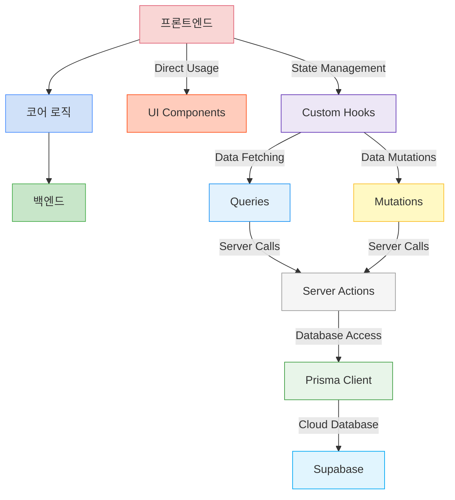
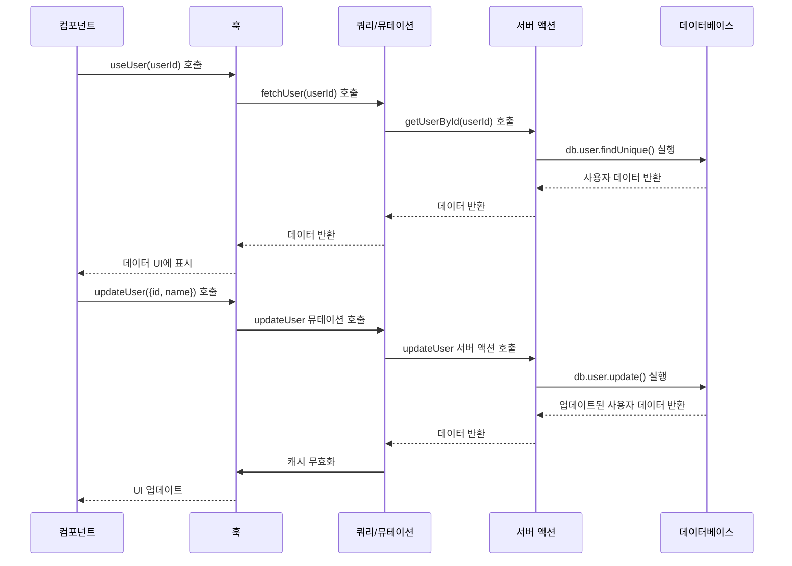

# Project Structure

Starglow follows a well-organized structure to maintain code clarity and separation of concerns.

## 전체 아키텍처



## 디렉토리 구조 개요

```
app/
├── _components/      # 공통 컴포넌트 (주로 서버 컴포넌트)
├── (routes)/         # 라우팅 구조 (괄호는 그룹화만 위한 것임)
│   ├── (auth)/       # 인증 관련 페이지
│   ├── (main)/       # 메인 페이지들
│   └── (profile)/    # 프로필 관련 페이지들
│
├── actions/          # 순수 서버 로직만
│   ├── users.ts
│   ├── files.ts
│   └── events.ts
│
├── queries/          # 데이터 가져오는 쿼리 함수 (캐싱용)
│   ├── userQueries.ts
│   ├── filesQueries.ts
│   └── eventQueries.ts
│
├── mutations/        # 서버에 데이터 변경하는 뮤테이션 함수
│   ├── userMutations.ts
│   ├── filesMutations.ts
│   └── eventMutations.ts
│
├── hooks/            # React 상태 및 로직 관리
│   ├── useUser.ts
│   ├── useFiles.ts
│   ├── useEvents.ts
│   └── useToast.ts
│
├── types/            # 타입스크립트 타입 정의
│   ├── user.ts
│   └── events.ts
│
├── lib/              # 유틸리티 함수 및 설정
│   ├── db.ts         # Prisma 클라이언트
│   ├── auth.ts       # 인증 설정
│   └── utils.ts      # 유틸리티 함수
│
├── queryKeys.ts      # 쿼리 키 정의
├── layout.tsx        # 루트 레이아웃
├── providers.tsx     # 전역 프로바이더
└── globals.css       # 전역 스타일
```

## 디렉토리 구조 상세 설명

### `/app` - Next.js App Directory

Next.js App Router를 사용하는 메인 애플리케이션 디렉토리로, 모든 라우트, 레이아웃, 페이지를 포함합니다.

```tsx
// app/layout.tsx
import { Providers } from "./providers";
import "./globals.css";

export const metadata = {
  title: "Starglow",
  description: "Starglow application",
};

export default function RootLayout({
  children,
}: {
  children: React.ReactNode;
}) {
  return (
    <html lang="ko">
      <body>
        <Providers>{children}</Providers>
      </body>
    </html>
  );
}
```

### `/app/(routes)` - 라우팅 구조

Next.js App Router 기능을 사용하는 라우팅 구조입니다.

```
(routes)/
├── page.tsx           # 홈 페이지 (/)
├── (auth)/            # 인증 관련 페이지
│   ├── signin/        # 로그인 페이지 (/signin)
│   └── signup/        # 회원가입 페이지 (/signup)
├── (main)/            # 메인 페이지들
│   ├── dashboard/     # 대시보드 페이지 (/dashboard)
│   └── events/        # 이벤트 페이지 (/events)
└── (profile)/         # 프로필 관련 페이지들
    └── [id]/          # 동적 프로필 페이지 (/profile/[id])
```

페이지 예시:

```tsx
// app/(main)/dashboard/page.tsx
import { DashboardClient } from "./_components/dashboard-client";
import { getServerSession } from "next-auth";
import { redirect } from "next/navigation";

export default async function DashboardPage() {
  const session = await getServerSession();

  if (!session) {
    redirect("/signin");
  }

  return <DashboardClient />;
}
```

### `/app/actions` - Server Actions

데이터 작업을 위한 서버 측 로직을 포함합니다.

```tsx
// app/actions/users.ts
"use server";

import { db } from "@/app/lib/db";
import { revalidatePath } from "next/cache";

export async function getUserById(id: string) {
  return db.user.findUnique({
    where: { id },
  });
}

export async function updateUser(
  id: string,
  data: { name?: string; email?: string }
) {
  const user = await db.user.update({
    where: { id },
    data,
  });

  revalidatePath(`/profile/${id}`);
  return user;
}
```

### `/app/queries` - Query Functions

캐싱 지원을 통한 데이터 가져오기 함수를 포함합니다.

```tsx
// app/queries/userQueries.ts
import { getUserById, getAllUsers } from "@/app/actions/users";
import { User } from "@/app/types/user";

export async function fetchUser(userId: string): Promise<User | null> {
  if (!userId) return null;

  try {
    return await getUserById(userId);
  } catch (error) {
    console.error("Error fetching user:", error);
    throw new Error("Failed to fetch user");
  }
}

export async function fetchUsers(role?: string): Promise<User[]> {
  try {
    return await getAllUsers(role);
  } catch (error) {
    console.error("Error fetching users:", error);
    throw new Error("Failed to fetch users");
  }
}
```

### `/app/mutations` - Mutation Functions

데이터 수정 함수를 포함합니다.

```tsx
// app/mutations/userMutations.ts
import { updateUser as updateUserAction } from "@/app/actions/users";
import { User, UpdateUserInput } from "@/app/types/user";

export async function updateUser(data: UpdateUserInput): Promise<User> {
  try {
    return await updateUserAction(data.id, {
      name: data.name,
      email: data.email,
    });
  } catch (error) {
    console.error("Error updating user:", error);
    throw new Error("Failed to update user");
  }
}
```

### `/app/hooks` - React Hooks

상태 관리 및 비즈니스 로직을 위한 커스텀 React 훅을 포함합니다.

```tsx
// app/hooks/useUser.ts
import { useQuery, useMutation, useQueryClient } from "@tanstack/react-query";
import { fetchUser } from "@/app/queries/userQueries";
import { updateUser } from "@/app/mutations/userMutations";
import { QUERY_KEYS } from "@/app/queryKeys";

export function useUser(userId: string) {
  return useQuery({
    queryKey: [QUERY_KEYS.USERS, userId],
    queryFn: () => fetchUser(userId),
    enabled: !!userId,
  });
}

export function useUpdateUser() {
  const queryClient = useQueryClient();

  return useMutation({
    mutationFn: updateUser,
    onSuccess: (data, variables) => {
      queryClient.invalidateQueries({
        queryKey: [QUERY_KEYS.USERS, variables.id],
      });
    },
  });
}
```

### `/app/types` - TypeScript 타입 정의

애플리케이션 전체에서 사용되는 타입을 정의합니다.

```tsx
// app/types/user.ts
export interface User {
  id: string;
  name: string | null;
  email: string | null;
  image: string | null;
  role: string;
}

export interface UpdateUserInput {
  id: string;
  name?: string;
  email?: string;
}
```

### `/app/lib` - 유틸리티 및 설정

유틸리티 함수와 설정을 포함합니다.

```tsx
// app/lib/db.ts
import { PrismaClient } from "@prisma/client";

const globalForPrisma = global as unknown as {
  prisma: PrismaClient | undefined;
};

export const db =
  globalForPrisma.prisma ??
  new PrismaClient({
    log: process.env.NODE_ENV === "development" ? ["error", "warn"] : ["error"],
  });

if (process.env.NODE_ENV !== "production") globalForPrisma.prisma = db;
```

### `/app/queryKeys.ts` - Query Keys

TanStack Query 캐시 관리를 위한 키를 정의합니다.

```tsx
// app/queryKeys.ts
export const QUERY_KEYS = {
  USERS: "users",
  PLAYERS: "players",
  QUESTS: "quests",
  POLLS: "polls",
  EVENTS: "events",
  FILES: "files",
} as const;
```

### `/app/components` - UI Components

애플리케이션 전체에서 사용되는 모든 React 컴포넌트를 포함합니다.

```tsx
// app/_components/button.tsx
import { ButtonHTMLAttributes, forwardRef } from "react";
import { cn } from "@/app/lib/utils";

interface ButtonProps extends ButtonHTMLAttributes<HTMLButtonElement> {
  variant?: "default" | "outline" | "ghost";
  size?: "sm" | "md" | "lg";
}

const Button = forwardRef<HTMLButtonElement, ButtonProps>(
  ({ className, variant = "default", size = "md", ...props }, ref) => {
    return (
      <button
        ref={ref}
        className={cn(
          "rounded-md font-medium focus:outline-none",
          {
            "bg-blue-500 text-white hover:bg-blue-600": variant === "default",
            "border border-gray-300 hover:bg-gray-100": variant === "outline",
            "hover:bg-gray-100": variant === "ghost",
            "px-3 py-1 text-sm": size === "sm",
            "px-4 py-2": size === "md",
            "px-6 py-3 text-lg": size === "lg",
          },
          className
        )}
        {...props}
      />
    );
  }
);

Button.displayName = "Button";

export { Button };
```

## 코드 흐름 예시

### 사용자 프로필 페이지 및 수정 기능



1. **컴포넌트** (`app/(profile)/[id]/page.tsx`)

```tsx
import { ProfileForm } from "./_components/profile-form";
import { getUserById } from "@/app/actions/users";
import { notFound } from "next/navigation";

export default async function ProfilePage({
  params,
}: {
  params: { id: string };
}) {
  const user = await getUserById(params.id);

  if (!user) {
    notFound();
  }

  return (
    <div>
      <h1>프로필</h1>
      <ProfileForm initialData={user} />
    </div>
  );
}
```

2. **클라이언트 컴포넌트** (`app/(profile)/[id]/_components/profile-form.tsx`)

```tsx
"use client";

import { useUpdateUser } from "@/app/hooks/useUser";
import { User } from "@/app/types/user";
import { useState } from "react";
import { Button } from "@/app/_components/button";

export function ProfileForm({ initialData }: { initialData: User }) {
  const [name, setName] = useState(initialData.name || "");
  const { mutate: updateUser, isPending } = useUpdateUser();

  const onSubmit = (e: React.FormEvent) => {
    e.preventDefault();
    updateUser({ id: initialData.id, name });
  };

  return (
    <form onSubmit={onSubmit}>
      <div>
        <label htmlFor="name">이름</label>
        <input
          id="name"
          value={name}
          onChange={(e) => setName(e.target.value)}
        />
      </div>
      <Button type="submit" disabled={isPending}>
        {isPending ? "저장 중..." : "저장"}
      </Button>
    </form>
  );
}
```

## 데이터 흐름

1. **Component**가 **Hook**을 사용하여 데이터와 상호작용
2. **Hook**이 **Query** 또는 **Mutation** 함수 호출
3. **Query** 함수는 데이터 조회, **Mutation** 함수는 **Actions** 호출
4. **Actions**이 Prisma를 사용하여 실제 데이터베이스 작업 수행

## 코드 조직화 가이드라인

1. 파일은 단일 책임에 집중
2. 각 디렉토리에 대한 명명 규칙 따르기
3. UI 로직을 데이터 가져오기 및 상태 관리와 분리
4. TypeScript로 적절한 타입 지정
5. 애플리케이션 전체에서 일관된 오류 처리 유지

### 명명 규칙

| 디렉토리   | 파일 명명 규칙         | 예시                    |
| ---------- | ---------------------- | ----------------------- |
| actions    | 복수형명사.ts          | users.ts, files.ts      |
| queries    | 복수형명사Queries.ts   | userQueries.ts          |
| mutations  | 복수형명사Mutations.ts | userMutations.ts        |
| hooks      | use대문자명사.ts       | useUser.ts, useFiles.ts |
| components | 케밥-케이스.tsx        | user-profile.tsx        |
| types      | 소문자명사.ts          | user.ts, event.ts       |

## 새 기능 추가하기

새 기능을 추가할 때:

1. 필요한 데이터 구조 식별
2. `/app/actions`에 서버 액션 생성
3. 쿼리와 뮤테이션을 각 디렉토리에 생성
4. 컴포넌트에 기능을 노출할 훅 생성
5. 이러한 훅을 사용하는 UI 컴포넌트 구축

## CI/CD 통합

코드베이스는 GitHub Actions와 통합되어 있어 다음과 같은 작업이 자동화됩니다:

1. **지속적 통합 (CI)**: 모든 PR에서 린팅 및 타입 검사 실행
2. **데이터베이스 스키마 시각화**: 스키마 변경 시 ER 다이어그램 생성
3. **자동 배포**: 메인 브랜치 변경 시 Vercel에 자동 배포

이 구조는 코드의 모듈성, 유지 관리성 및 확장성을 보장하며 팀원 간의 협업을 용이하게 합니다.
