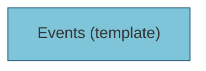

# Events 템플릿 분석

## 컴포넌트 구조



## 사용된 컴포넌트


## 상태 관리

- `page`: 1
- `category`: undefined
- `status`: undefined

## 사용된 훅

- `useState`
- `useEvents`

## 임포트된 모듈

```
@prisma/client
next/image
@/app/hooks/useEvents
react
lucide-react
../atoms/Typography
@/lib/utils/tailwind
@/lib/utils/responsiveClass
../atoms/Icon
next/link
../organisms/NavBar
../atoms/PartialLoading
```

## 전체 컴포넌트 트리

- **Events** (template)

