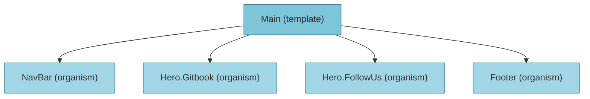

# Main 템플릿 분석

## 컴포넌트 구조



## 사용된 컴포넌트

- **NavBar** (organism): `@/components/organisms/NavBar`
- **HeroGitbook** (organism): `@/components/organisms/Hero.Gitbook`
- **HeroFollowUs** (organism): `@/components/organisms/Hero.FollowUs`
- **Footer** (organism): `@/components/organisms/Footer`

## 상태 관리

- 이 템플릿에서는 상태를 사용하지 않습니다.

## 사용된 훅

- 이 템플릿에서는 커스텀 훅을 사용하지 않습니다.

## 임포트된 모듈

```
@/components/organisms/NavBar
@/components/organisms/Hero.Gitbook
@/components/organisms/Hero.FollowUs
@/components/organisms/Footer
next/image
```

## 전체 컴포넌트 트리

- **Main** (template)
  - **NavBar** (organism)
  - **Hero.Gitbook** (organism)
  - **Hero.FollowUs** (organism)
  - **Footer** (organism)

