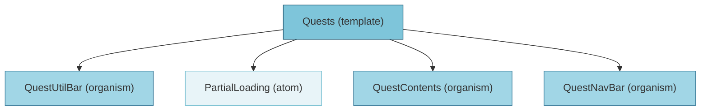

# Quests 템플릿 분석

## 컴포넌트 구조



## 사용된 컴포넌트

- **PartialLoading** (atom): `@/components/atoms/PartialLoading`
- **QuestUtilBar** (organism): `@/components/organisms/QuestUtilBar`
- **QuestContents** (organism): `@/components/organisms/QuestContents`
- **QuestNavBar** (organism): `@/components/organisms/QuestNavBar`

## 상태 관리

- `contentType`: "Today"

## 사용된 훅

- `useState`
- `usePlayer`

## 임포트된 모듈

```
react
@/components/organisms/QuestUtilBar
@/components/organisms/QuestContents
@/components/organisms/QuestNavBar
@prisma/client
@/app/hooks/usePlayer
@/components/atoms/PartialLoading
```

## 전체 컴포넌트 트리

- **Quests** (template)
  - **QuestUtilBar** (organism)
  - **PartialLoading** (atom)
  - **QuestContents** (organism)
  - **QuestNavBar** (organism)

