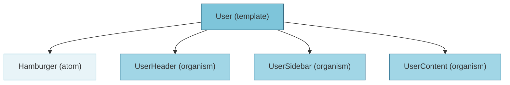

# User 템플릿 분석

## 컴포넌트 구조



## 사용된 컴포넌트

- **Hamburger** (atom): `@/components/atoms/Hamburger`
- **UserHeader** (organism): `@/components/organisms/UserHeader`
- **UserSidebar** (organism): `@/components/organisms/UserSidebar`
- **UserContent** (organism): `@/components/organisms/UserContent`

## 상태 관리

- `contentType`: "myassets"

## 사용된 훅

- `useState`
- `useMobileMenu`
- `useToast`

## 임포트된 모듈

```
react
@/components/organisms/UserHeader
@/components/organisms/UserSidebar
@/components/organisms/UserContent
@/components/atoms/Hamburger
@/app/hooks/useMobileMenu
@prisma/client
framer-motion
@/app/hooks/useToast
```

## 전체 컴포넌트 트리

- **User** (template)
  - **Hamburger** (atom)
  - **UserHeader** (organism)
  - **UserSidebar** (organism)
  - **UserContent** (organism)

